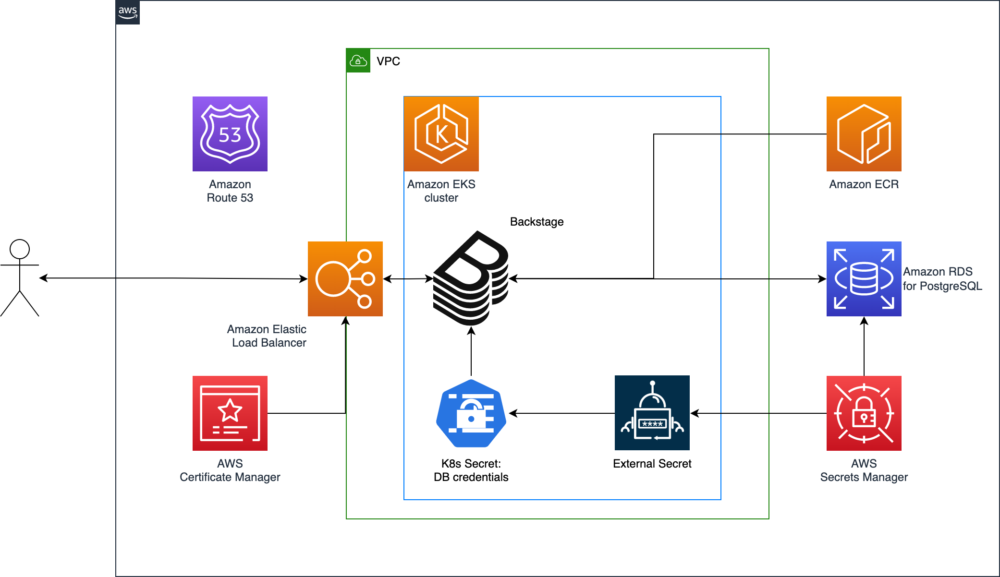
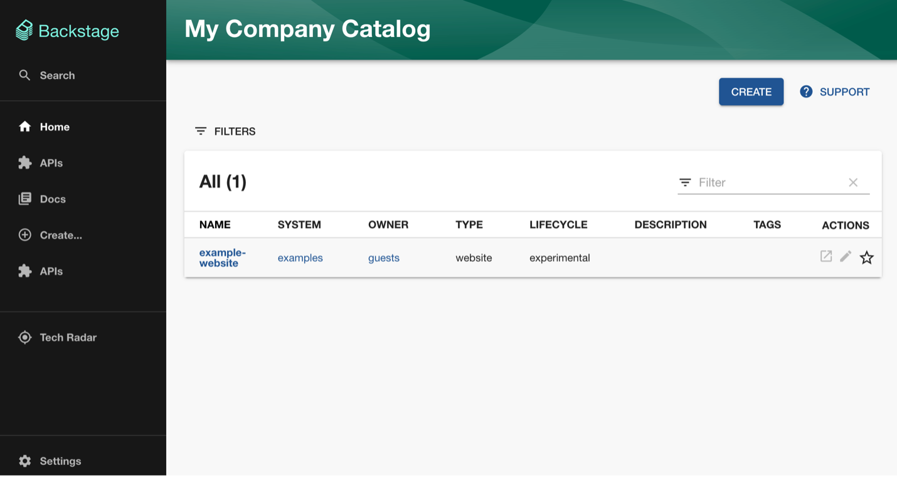

# Backstage on EKS

## Objective

[Backstage](https://backstage.io/) is an application that aims to facilitate introduction and maintenance of standards and best practices, across the organization, tying all infrastructure tooling, resources, owners, contributors, and administrators together in one place.

The base functionality is provided by the Core component, which is assembled together with Plugins into an Application. Plugins extend the Core with additional functionalities that can be open source, or proprietary to a company.

The objective of this pattern is to illustrate how to deploy a Backstage pre-built Docker image, using the [Amazon EKS Blueprints Backstage add-on](https://github.com/aws-quickstart/cdk-eks-blueprints/blob/main/docs/addons/backstage.md).

## Architecture



## Approach

This blueprint will include the following:

- A new Well-Architected VPC with both Public and Private subnets
- A new Well-Architected EKS cluster in the region and account you specify
- An Application Load Balancer (ALB), implementing the Backstage Ingress rules
- An Amazon RDS for PostgreSQL instance
- A certificate, assigned to the ALB
- A Secret in AWS Secrets Manager, storing the database credentials, imported into the cluster via [ExternalsSecretsAddOn](https://aws-quickstart.github.io/cdk-eks-blueprints/addons/external-secrets/)
- Other popular add-ons

## Prerequisites

Ensure that you have installed the following tools on your machine:

- [aws cli](https://docs.aws.amazon.com/cli/latest/userguide/install-cliv2.html) (also ensure it is [configured](https://docs.aws.amazon.com/cli/latest/userguide/getting-started-quickstart.html#getting-started-quickstart-new))
- [cdk](https://docs.aws.amazon.com/cdk/v2/guide/getting_started.html#getting_started_install)
- [npm](https://docs.npmjs.com/cli/v8/commands/npm-install)
- [tsc](https://www.typescriptlang.org/download)
- [make](https://www.gnu.org/software/make/)
- [Docker](https://docs.docker.com/get-docker/)

Let’s start by setting the account and region environment variables:

```sh
ACCOUNT_ID=$(aws sts get-caller-identity --query 'Account' --output text)
AWS_REGION=$(aws configure get region)
```

Create the [Backstage application](https://backstage.io/docs/getting-started/create-an-app), command reported here for your convenience:

```sh
npx @backstage/create-app@latest
```

Build the corresponding [Docker image](https://backstage.io/docs/deployment/docker), commands reported here for your convenience:

```sh
cd ./backstage
yarn install --frozen-lockfile
yarn tsc
yarn build:backend --config app-config.yaml
```

Note: if the above command throws an error caused by app-config.yaml not found, you can explicitly set the path to the file:

```sh
yarn build:backend --config $(pwd)/app-config.yaml
```
Then you can progress with the docker image build:

```sh
docker image build . -f packages/backend/Dockerfile --tag backstage
```

Note: consider the platform you are building on, and the target platform the image will run on, you might want to use the [--platform option](https://docs.docker.com/engine/reference/commandline/buildx_build/), e.g.:

```sh
docker buildx build ... --platform=...
```

Note: If you are running a version of Docker Engine version earlier than 23.0, you might need to enable BuildKit manually, like explained in the [Getting Started section](https://docs.docker.com/build/buildkit/#getting-started) of the BuildKit webpage.

(Optional) to show examples on the UI, add to Docker file:

```sh
COPY --chown=node:node examples /examples
```

Create an Amazon Elastic Container Registry (ECR) repository, named _backstage_:

```sh
aws ecr create-repository --repository-name backstage
```

```sh
DOCKER_IMAGE_ID=... #see output of image id from above image creation
aws ecr get-login-password --region $AWS_REGION | docker login --username AWS --password-stdin $ACCOUNT_ID.dkr.ecr.$AWS_REGION.amazonaws.com
docker tag $DOCKER_IMAGE_ID $ACCOUNT_ID.dkr.ecr.$AWS_REGION.amazonaws.com/backstage:latest
docker push $ACCOUNT_ID.dkr.ecr.$AWS_REGION.amazonaws.com/backstage:latest
```

Setup a Hosted Zone in Route 53, with your parent domain. The pattern will create a new subdomain with format _{backstage subdomain label}.{parent domain}_. The default value for _{backstage subdomain label}_ is _backstage_ (see parameters below).

## Deployment

Clone the repository:

```sh
git clone https://github.com/aws-samples/cdk-eks-blueprints-patterns.git
cd cdk-eks-blueprints-patterns
```

Set the pattern's parameters in the CDK context by overriding the _cdk.json_ file (edit _PARENT_DOMAIN_NAME_ as it fits):

```sh
PARENT_DOMAIN_NAME=example.com
HOSTED_ZONE_ID=$(aws route53 list-hosted-zones-by-name --dns-name $PARENT_DOMAIN_NAME --query "HostedZones[].Id" --output text | xargs basename)
cat << EOF > cdk.json
{
    "app": "npx ts-node dist/lib/common/default-main.js",
    "context": {
        "backstage.image.registry.name": "${ACCOUNT_ID}.dkr.ecr.${AWS_REGION}.amazonaws.com",
        "backstage.parent.domain.name":"${PARENT_DOMAIN_NAME}",
        "backstage.hosted.zone.id": "${HOSTED_ZONE_ID}"
      }
}
EOF
```

(Optional) The full list of parameters you can set in the _context_ is:

```
    "context": {
        "backstage.namespace.name": ...,
        "backstage.image.registry.name": ...,
        "backstage.image.repository.name": ...,
        "backstage.image.tag.name": ...,
        "backstage.parent.domain.name": ...,
        "backstage.subdomain.label": ...,
        "backstage.hosted.zone.id": ...,
        "backstage.certificate.resource.name": ...,
        "backstage.database.resource.name": ...,
        "backstage.database.instance.port": ...,
        "backstage.database.secret.resource.name": ...,
        "backstage.database.username": ...,
        "backstage.database.secret.target.name": ...,
      }
```

You can assign values to the above keys according to the following criteria (values are required where you don't see _default_ mentioned):

- "backstage.namespace.name": Backstage's namespace, the default is "backstage"
- "backstage.image.registry.name": the image registry for the Backstage Helm chart in Amazon ECR, a value similar to "youraccount.dkr.ecr.yourregion.amazonaws.com"
- "backstage.image.repository.name": the image repository for the Backstage Helm chart, the default is "backstage"
- "backstage.image.tag.name": the image tag, the default is "latest"
- "backstage.parent.domain.name": the parent domain in your Hosted Zone
- "backstage.subdomain.label": to be used as _{"subdomain.label"}.{"parent.domain.name"}_, the default is "backstage"
- "backstage.hosted.zone.id": the Hosted zone ID (format: 20x chars/numbers)
- "backstage.certificate.resource.name": resource name of the certificate, registered by the resource provider, the default is "backstage-certificate"
- "backstage.database.resource.name": resource name of the database, registered by the resource provider, the default is "backstage-database"
- "backstage.database.instance.port": the port the database will use, the default is 5432
- "backstage.database.secret.resource.name": resource name of the database's Secret, registered by the resource provider, the default is "backstage-database-credentials"
- "backstage.database.username": the username for the database's credentials, the default is "postgres"
- "backstage.database.secret.target.name": the name to be used when creating the Secret, the default is "backstage-database-secret"

If you haven't done it before, [bootstrap your cdk account and region](https://docs.aws.amazon.com/cdk/v2/guide/bootstrapping.html).

Run the following commands:

```sh
make deps
make build
make pattern backstage deploy
```
When deployment completes, the output will be similar to the following:


Navigate to the URL indicated by the first line in the output (_backstage-blueprint.BackstagebaseURL ...), you should see the screen below:



To see the deployed resources within the cluster, please run:

```sh
kubectl get pod,svc,secrets,ingress -A
```

A sample output is shown below:


## Next steps

You can go the [AWS Blog](https://aws.amazon.com/blogs/) to explore how to use Backstage e.g., [as an API Developer Portal for Amazon API Gateway](https://aws.amazon.com/blogs/opensource/how-traveloka-uses-backstage-as-an-api-developer-portal-for-amazon-api-gateway/) or [to provision infrastructure using AWS Proton](https://aws.amazon.com/blogs/containers/provisioning-infrastructure-using-the-aws-proton-open-source-backstage-plugin/). On the Backstage website you can also see other examples of [how to use and expand Backstage](https://backstage.io/demos/).

## Cleanup

To clean up your EKS Blueprints, run the following commands:

```sh
make pattern backstage destroy 
```
