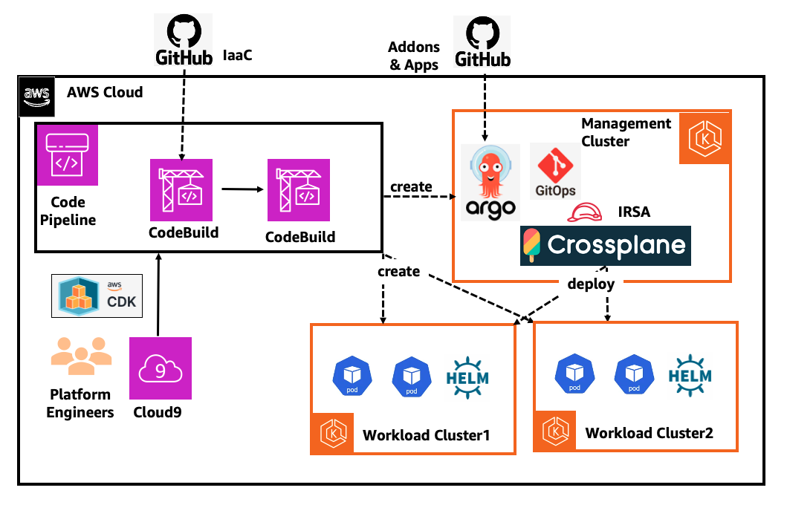
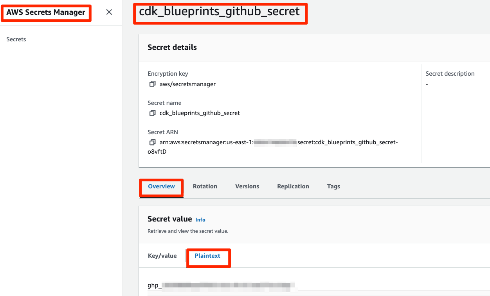
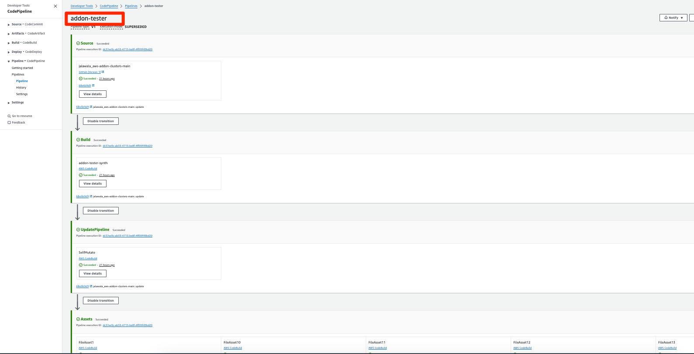
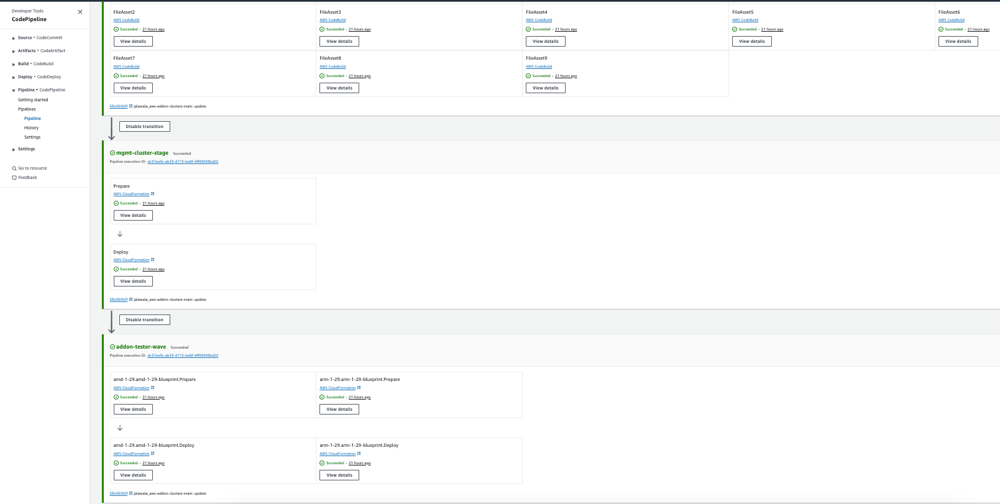
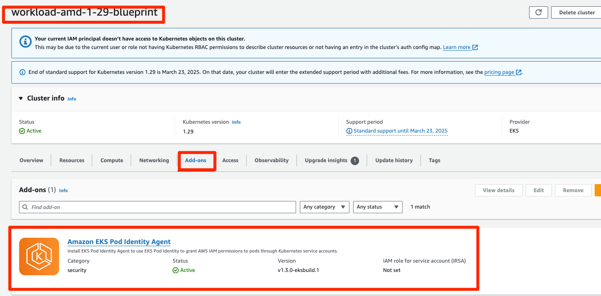
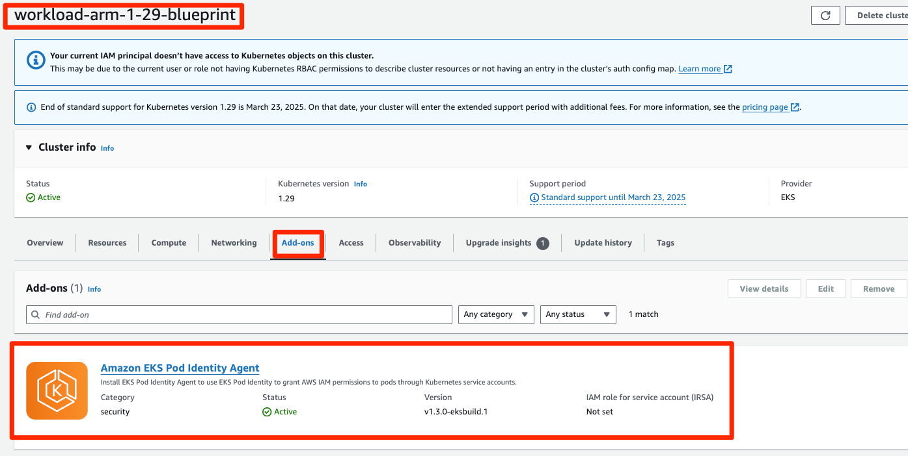

# GitOps based Multi-cluster add-on and Apps Management using Crossplane and ArgoCD

## Objective

The objective of this pattern is to provide centralized management of Amazon EKS add-ons, Kubernetes Applications and Helm charts in workload clusters. This approach consists of a Management Cluster and multiple workload clusters. The Management Cluster is created with ArgoCD and Crossplane add-ons. The platform team creates Crossplane Manifest files for Amazon EKS add-ons/Kubernetes Applications/Helm charts and pushes them to the GitOps Repo. The ArgoCD Application Controller in the Management Cluster reconciles these Crossplane Manifests and deploy them into Management Cluster.  The Crossplane Controller in the Management Cluster deploys the Amazon EKS add-ons/Kubernetes Applications/Helm charts into the Workload Clusters.

This helps platform teams to simplify the process of deploying add-ons and Apps from a central Management Cluster. In this Solution, we use CDK to deploy AWS CodePipeline which monitors this platform repo and deploy the Management and Workload Clusters using CDK EKS Blueprints.

## Architecture



## Approach

This blueprint will include the following:

* AWS CodePipeline which deploys the Management and Workload Clusters
* A new Well-Architected EKS cluster `mgmt-cluster` and two workload EKS Clusters `workload-amd-1-29-blueprint` and `workload-arm-1-29-blueprint` in the region and account you specify.
* [Amazon VPC CNI add-on (VpcCni)](https://docs.aws.amazon.com/eks/latest/userguide/managing-vpc-cni.html) into your cluster to support native VPC networking for Amazon EKS.
*  The Management Cluster is deployed with the following add-ons.
      * Upbound Universal Crossplane Provider
      * Upbound AWS Family Crossplane Provider
      * Upbound AWS EKS Crossplane Provider
      * Kubernetes Crossplane Provider
      * Helm Crossplane Provider
      * Secrets Store AddOn
      * ArgoCD add-on
* The ArgoCD add-on is bootstrapped with [GitOps](https://github.com/aws-samples/eks-blueprints-workloads) which contains Crossplane Manifest files to deploy EKS add-ons, Kubernetes Manifests and also Helm Charts.

## GitOps Configuration

For GitOps, the blueprint bootstrap the ArgoCD add-on and points to the [EKS Blueprints Workload](https://github.com/aws-samples/eks-blueprints-workloads) sample repository.


## Prerequisites

Ensure that you have installed the following tools on your machine.

1. [aws cli](https://docs.aws.amazon.com/cli/latest/userguide/install-cliv2.html)
2. [kubectl](https://Kubernetes.io/docs/tasks/tools/)
3. [cdk](https://docs.aws.amazon.com/cdk/v2/guide/getting_started.html#getting_started_install)
4. [npm](https://docs.npmjs.com/cli/v8/commands/npm-install)
5. [helm](https://helm.sh/docs/intro/install/)
6. GitHub Access Token for this repo and AWS secret

### Create AWS Secret Manager Secret

Create a plain-text Amazon secret to hold a fine-grained GitHub access token for this repo in the desired region, and
set its name as a value to the GITHUB_SECRET environment variable. Default value is `cdk_blueprints_github_secret`.

> **WARNING:** When switching the CDK between region, remember to replicate this secret!!!!

```shell
export ACCOUNT_ID=$(aws sts get-caller-identity --output text --query Account)
export AWS_REGION=$(curl -s 169.254.169.254/latest/dynamic/instance-identity/document | jq -r '.region')
export CDK_REPO_GITHUB_PAT_TOKEN=<set_token_here>
export CDK_REPO_AWS_SECRET_NAME="cdk_blueprints_github_secret"
aws secretsmanager create-secret --region $AWS_REGION \
    --name $CDK_REPO_AWS_SECRET_NAME \
    --description "GitHub Personal Access Token for CodePipeline to access GitHub account" \
    --secret-string $CDK_REPO_GITHUB_PAT_TOKEN
```

The Secret will look like this in the AWS Console.




### GitHub Access Token for the `GitOps` repo

In the [GitOps](https://github.com/aws-samples/eks-blueprints-workloads) repository, there are some ArgoCD Application configuration files,  which in turn points to Crossplane Manifest files. These Crossplane Manifest files will be applied by ArgoCD in the Management Cluster to deploy EKS add-ons, Kubernetes Manifests and Helm charts into the workload clusters. To configure access to this repo for ArgoCD Repo Server, you need to create a GitHub token to access the `GitOps` repo. First create a plain-text Amazon secret `github-token` AWS Secret Manager, to hold a fine-grained GitHub access token for `GitOps` repo.

```shell
export GIT_OPS_GITHUB_PAT_TOKEN=<set_token_here>
export GIT_OPS_AWS_SECRET_NAME="github-token"
aws secretsmanager create-secret --region $AWS_REGION \
    --name $GIT_OPS_AWS_SECRET_NAME \
    --description "GitHub Personal Access Token for ArgoCD to access Grossplane Manifests" \
    --secret-string $GIT_OPS_GITHUB_PAT_TOKEN
```

#### SecretProviderClass object in Management Cluster

We will create SecretProviderClass  object in  `team-argocd`  Namespace as part of the Management cluster creation. This will be used by the ArgoCD Controller to reconcile the ArgoCD Application Manifest file in the GitOps repository.


## Deploy

1. Clone the repository and install dependency packages. This repository contains CDK v2 code written in TypeScript.

```
git clone https://github.com/aws-samples/cdk-eks-blueprints-patterns.git
cd cdk-eks-blueprints-patterns
npm i
```

2. Execute the commands below to bootstrap the AWS environment

```
cdk bootstrap aws://$ACCOUNT_ID/$AWS_REGION
```

4. Run the following command from the root of this repository to deploy the pipeline stack:

```
make build
make list
make pattern crossplane-argocd-gitops deploy
```

## Cluster Access

### View the CodePipeline





### Create Kube context to access the `mgmt-cluster`

Go to the CloudFormation Stack `mgmt-cluster-stage-mgmt-cluster-stage-blueprint` outputs and search for a key starting with `mgmtclusterstageblueprintConfigCommand` and copy it's value which an aws command to create a the kubecontext for the `mgmt-cluster`

The example command looks like below.

```shell
aws eks update-kubeconfig --name mgmt-cluster --region us-west-2 --role-arn arn:aws:iam::ACCOUNT_ID:role/mgmt-cluster-stage-mgmt-c-managementclusterAccessRo-XYSC5PKL8WnA
```

The output will look like below.

```shell
Updated context arn:aws:eks:us-west-2:ACCOUNT_ID:cluster/mgmt-cluster in /Users/<user_name>/.kube/config
```

Set below environment variable to the above context

```shell
export MANAGEMENT_CLUSTER_CONTEXT="arn:aws:eks:${AWS_REGION}:${ACCOUNT_ID}:cluster/mgmt-cluster"
echo "export  MANAGEMENT_CLUSTER_CONTEXT=${MANAGEMENT_CLUSTER_CONTEXT}" >> ~/.bash_profile
```
Run below command to validate the access to the `mgmt-cluster`

```shell
kubectl  --context $MANAGEMENT_CLUSTER_CONTEXT get node
```

The output will like below.

```shell
NAME                           STATUS   ROLES    AGE    VERSION
ip-10-0-116-4.ec2.internal     Ready    <none>   6d8h   v1.28.8-eks-ae9a62a
ip-10-0-175-104.ec2.internal   Ready    <none>   6d8h   v1.28.8-eks-ae9a62a
```


Run below command to get list of Crossplane Providers deployed into the `mgmt-cluster`

```shell
kubectl  --context $MANAGEMENT_CLUSTER_CONTEXT get providers.pkg.crossplane.io
```

The output will like below.

```shell
NAME                          INSTALLED   HEALTHY   PACKAGE                                                          AGE
helm-provider                 True        True      xpkg.upbound.io/crossplane-contrib/provider-helm:v0.18.1         47h
kubernetes-provider           True        True      xpkg.upbound.io/crossplane-contrib/provider-kubernetes:v0.13.0   25h
provider-aws-eks              True        True      xpkg.upbound.io/upbound/provider-aws-eks:v1.1.0                  8d
upbound-provider-family-aws   True        True      xpkg.upbound.io/upbound/provider-family-aws:v1.4.0               8d
```


Run below command to get the Crossplane Providers pods to the `mgmt-cluster`

```shell
kubectl  --context $MANAGEMENT_CLUSTER_CONTEXT get pod -n upbound-system
```

The output will like below.

```shell
NAME                                                        READY   STATUS    RESTARTS   AGE
crossplane-594b65bfdb-pgkxf                                 1/1     Running   0          6d8h
crossplane-rbac-manager-86c74cf5d-tjcw8                     1/1     Running   0          6d8h
helm-provider-4d90a08b9ede-7c874b858b-pp26d                 1/1     Running   0          47h
kubernetes-provider-a3cbbe355fa7-55846cfbfb-6tpcl           1/1     Running   0          25h
provider-aws-eks-23042d28ed58-66d9db8476-jr6mb              1/1     Running   0          6d8h
upbound-provider-family-aws-bac5d48bd353-64845bdcbc-4vpn6   1/1     Running   0          6d8h            8d
```


Run below command to get the ArgoCD pods deployed into the `mgmt-cluster`

```shell
kubectl  --context $MANAGEMENT_CLUSTER_CONTEXT get pod -n argocd
```

The output will like below.

```shell
NAME                                                              READY   STATUS    RESTARTS       AGE
blueprints-addon-argocd-application-controller-0                  1/1     Running   0              24h
blueprints-addon-argocd-applicationset-controller-7b78c7fc94ls9   1/1     Running   0              24h
blueprints-addon-argocd-dex-server-6cf94ddc54-dfhv7               1/1     Running   0              24h
blueprints-addon-argocd-notifications-controller-6f6b7d95cdd2tl   1/1     Running   0              24h
blueprints-addon-argocd-redis-b8dbc7dc6-h4bs8                     1/1     Running   0              24h
blueprints-addon-argocd-repo-server-fd57dc686-zkbsm               1/1     Running   0              4h15m
blueprints-addon-argocd-server-84c8b597c9-98c95                   1/1     Running   0              24h
```


### Create kubecontext to access the `workload-amd-1-29-blueprint` 

Go to the CloudFormation Stack `amd-1-29-workload-amd-1-29-blueprint` outputs and search for a key starting with `amd129blueprintConfigCommand` and copy it's value which an AWS command to create a the kubecontext for the `workload-amd-1-29-blueprint`

The example command looks like below.

```shell
aws eks update-kubeconfig --name workload-amd-1-29-blueprint --region us-west-2 --role-arn arn:aws:iam::ACCOUNT_ID:role/eks-workload-connector-role
```

The output will look like below.

```shell
Added new context arn:aws:eks:us-west-2:ACCOUNT_ID:cluster/workload-amd-1-29-blueprint to /Users/jalawala/.kube/config
```

Set below environment variable to the above context

```shell
export WORKLOAD_CLUSTER1_CONTEXT="arn:aws:eks:${AWS_REGION}:${ACCOUNT_ID}:cluster/workload-amd-1-29-blueprint"
echo "export  WORKLOAD_CLUSTER1_CONTEXT=${WORKLOAD_CLUSTER1_CONTEXT}" >> ~/.bash_profile
```
Run below commands to validate the access to the `workload-amd-1-29-blueprint`

```shell
kubectl --context $WORKLOAD_CLUSTER1_CONTEXT get node
```
The output will look like below.

```shell
NAME                          STATUS   ROLES    AGE    VERSION
ip-10-0-96-158.ec2.internal   Ready    <none>   6d9h   v1.29.3-eks-ae9a62a
```

### Create Kube context to access the `workload-arm-1-29-blueprint` 

Go to the CloudFormation Stack `arm-1-29-workload-arm-1-29-blueprint` outputs and search for a key starting with `arm129blueprintConfigCommand` and copy it's value which an aws command to create a the kubecontext for the `workload-arm-1-29-blueprint`

The example command looks like below.

```shell
aws eks update-kubeconfig --name workload-arm-1-29-blueprint --region us-west-2 --role-arn arn:aws:iam::$ACCOUNT_ID:role/eks-workload-connector-role
```

The output will look like below.

```shell
Added new context arn:aws:eks:us-west-2:ACCOUNT_ID:cluster/workload-arm-1-29-blueprint to /Users/jalawala/.kube/config
```

Set below environment variable to the above context

```shell
export WORKLOAD_CLUSTER2_CONTEXT="arn:aws:eks:${AWS_REGION}:${ACCOUNT_ID}:cluster/workload-arm-1-29-blueprint"
echo "export  WORKLOAD_CLUSTER2_CONTEXT=${WORKLOAD_CLUSTER2_CONTEXT}" >> ~/.bash_profile
```
Run below commands to validate the access to the `workload-arm-1-29-blueprint`

```shell
kubectl --context $WORKLOAD_CLUSTER2_CONTEXT get node
```
The output will look like below.

```shell
NAME                          STATUS   ROLES    AGE    VERSION
ip-10-0-96-158.ec2.internal   Ready    <none>   6d9h   v1.29.3-eks-ae9a62a
```

### Access to Workload clusters using IAM role `eks-workload-connector-role`

Note that we create and add an IAM role `eks-workload-connector-role` with `system:masters` RBAC access to both of the workload clusters i.e. `workload-amd-1-29-blueprint` and `workload-arm-1-29-blueprint` as part of the Stack creation.

The Upbound AWS EKS Provider Pod will use its IRSA IAM role `mgmt-cluster-stage-mgmt-c-mgmtclusterstageblueprint-I8cnZsnO37rA` to assume the `eks-workload-connector-role` IAM role to gain access to the workload clusters. The `sts:AssumeRole` IAM permission is already added to the IRSA role during the Management cluster creation.

Since the IRSA role will use `eks-workload-connector-role` to create a kubecontext object and also to deploy EKS add-ons into the workload clusters, the `eks-workload-connector-role `role needs eks:* IAM permissions. 

Note this IAM permissions can be made very granular to provide least privileged access to workload clusters.


## Test 

### Install the ArgoCD ALI

In the ArgoCD CLI as per the [docs](https://argo-cd.readthedocs.io/en/stable/cli_installation/)

Get the ArgoCD Admin password using below command.

```shell
kubectl --context $MANAGEMENT_CLUSTER_CONTEXT  -n argocd get secret argocd-initial-admin-secret -o jsonpath="{.data.password}" | base64 -d; echo
```

Open a new Terminal and Run a local proxy server for the ArgoCD Server.

```shell
kubectl --context $MANAGEMENT_CLUSTER_CONTEXT port-forward svc/blueprints-addon-argocd-server -n argocd 8080:443
```
In the current Terminal run the ArgoCD login command.

```shell
argocd login localhost:8080 --username admin --password <admin_password>
```

Add EKS Cluster to ArgoCD.

```shell
argocd cluster add $MANAGEMENT_CLUSTER_CONTEXT
```
The output will look like below.

```shell
WARNING: This will create a service account `argocd-manager` on the cluster referenced by context `arn:aws:eks:us-west-2:ACCOUNT_ID:cluster/mgmt-cluster` with full cluster level privileges. Do you want to continue [y/N]? y
INFO[0004] ServiceAccount "argocd-manager" already exists in namespace "kube-system" 
INFO[0004] ClusterRole "argocd-manager-role" updated    
INFO[0005] ClusterRoleBinding "argocd-manager-role-binding" updated 
Cluster 'https://0F745A41ECA76297CBF070C032932033.sk1.us-west-2.eks.amazonaws.com' added
```

Run the below command to get the list of ArgoCD Applications.

```shell
argocd app list
```

The output will look like below.

```shell
NAME                   CLUSTER                         NAMESPACE  PROJECT  STATUS  HEALTH   SYNCPOLICY  CONDITIONS  REPO                                                        PATH                      TARGET
argocd/bootstrap-apps  https://kubernetes.default.svc  argocd     default  Synced  Healthy  Auto-Prune  <none>      https://github.com/aws-samples/eks-blueprints-workloads  ./common/testingClusters  main
argocd/cluster1        https://kubernetes.default.svc  argocd     default  Synced  Healthy  Auto-Prune  <none>      https://github.com/aws-samples/eks-blueprints-workloads  ./clusters/cluster1       main
argocd/cluster2        https://kubernetes.default.svc  argocd     default  Synced  Healthy  Auto-Prune  <none>      https://github.com/aws-samples/eks-blueprints-workloads  ./clusters/cluster2       main
```


### Validate EKS add-ons deployment in Workload Clusters

Run the below command to get the list of Crossplane AWS Provider Config Objects deployed in the Management Cluster.

```shell
kubectl  --context $MANAGEMENT_CLUSTER_CONTEXT get providerconfigs.aws.upbound.io
```

The output will look like below.

```shell
NAME                         AGE
common-provider-config-aws   23h
```

Run the below command to get the list of EKS add-on Objects deployed in the Management Cluster.

```shell
kubectl  --context $MANAGEMENT_CLUSTER_CONTEXT get add-ons.eks.aws.upbound.io
```

The output will look like below.

```shell
NAME                                    READY   SYNCED   EXTERNAL-NAME                               AGE
addon-eks-pod-identity-agent-amd-1-29   True    True     workload-amd-1-29-blueprint:eks-pod-identity-agent   4h15m
addon-eks-pod-identity-agent-arm-1-29   True    True     workload-arm-1-29-blueprint:eks-pod-identity-agent   4h15m
```

Go to the Workload EKS Clusters and Ensure that EKS add-on is deployed successfully.







### Validate Kubernetes Manifests deployment in Workload Clusters

Run the below command to get the list of Crossplane Kubernetes Provider Objects deployed in the Management Cluster.

```shell
kubectl  --context $MANAGEMENT_CLUSTER_CONTEXT get providerconfigs.kubernetes.crossplane.io
```

The output will look like below.

```shell
NAME                                     AGE
provider-config-k8s-workload-amd-1-29-blueprint   4h31m
provider-config-k8s-workload-arm-1-29-blueprint   4h40m
```

Run the below command to get the list of Namespaces in the Workload Cluster  `workload-amd-1-29-blueprint`

```shell
kubectl  --context $WORKLOAD_CLUSTER1_CONTEXT get ns
```

The output will look like below.

```shell
NAME                                STATUS   AGE
default                             Active   8d
external-secrets                    Active   8d
kube-node-lease                     Active   8d
kube-public                         Active   8d
kube-system                         Active   8d
test-namespace-workload-amd-1-29-blueprint   Active   4h9m
```


Run the below command to get the list of Namespaces in the Workload Cluster  `workload-arm-1-29-blueprint`

```shell
kubectl  --context $WORKLOAD_CLUSTER2_CONTEXT get ns
```

The output will look like below.

```shell
NAME                                STATUS   AGE
default                             Active   8d
external-secrets                    Active   8d
kube-node-lease                     Active   8d
kube-public                         Active   8d
kube-system                         Active   8d
test-namespace-workload-arm-1-29-blueprint   Active   4h9m
```

### Validate Helm Chart deployment in Workload Clusters

Run the below command to get the list of Crossplane Helm Provider Objects deployed in the Management Cluster.

```shell
kubectl  --context $MANAGEMENT_CLUSTER_CONTEXT get providerconfigs.helm.crossplane.io
```

The output will look like below.

```shell
NAME                                      AGE
provider-config-helm-workload-amd-1-29-blueprint   4h37m
provider-config-helm-workload-arm-1-29-blueprint   4h46m
```

Run the below command to get the list of helm charts in the Workload Cluster  `workload-amd-1-29-blueprint`

```shell
helm  --kube-context $WORKLOAD_CLUSTER1_CONTEXT list -A
```

The output will look like below.

```shell
NAME                                    NAMESPACE               REVISION        UPDATED                                  STATUS          CHART                   APP VERSION
blueprints-addon-external-secrets       external-secrets        1               2024-05-07 05:25:31.465715836 +0000 UTC  deployed        external-secrets-0.9.9  v0.9.9     
test-helm-workload-amd-1-29-blueprint            default                 1               2024-05-15 06:39:17.325950143 +0000 UTC  deployed        nginx-17.0.1            1.26.0  
```


Run the below command to get the list of Helm Charts in the Workload Cluster  `workload-arm-1-29-blueprint`

```shell
helm  --kube-context $WORKLOAD_CLUSTER2_CONTEXT list -A
```

The output will look like below.

```shell
NAME                                    NAMESPACE               REVISION        UPDATED                                  STATUS          CHART                   APP VERSION
blueprints-addon-external-secrets       external-secrets        1               2024-05-07 05:26:52.028907405 +0000 UTC  deployed        external-secrets-0.9.9  v0.9.9     
test-helm-workload-arm-1-29-blueprint            default                 1               2024-05-15 06:39:17.222351682 +0000 UTC  deployed        nginx-17.0.1            1.26.0   
```


