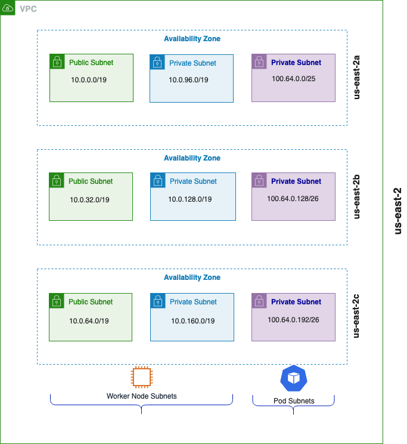

# Custom Networking on EKS
On Amazon EKS clusters, the default Container Networking Interface(CNI) is implemented by the Amazon VPC CNI plugin. When VPC CNI is used in EKS clusters, by default the VPC CNI assigns pods an IP address that's selected from the primary subnet of the VPC. The primary subnet is the subnet CIDR that the primary Elastic Network Interface(ENI) is attached to; usually it's the subnet of the worker node/host in the EKS cluster. If the primary subnet CIDR is too small, the CNI may not be able to have enough IP addresses to assign to the pods running in the cluster. This is a common challenge for EKS IPv4 clusters.

Custom Networking provides a solution to the IP exhaustion issue by assigning the Pod IPs from secondary VPC address spaces(CIDR). When custom networking is enabled in VPC CNI, it creates secondary ENIs in the subnet defined under a custom resource named ENIConfig that includes an alternate subnet CIDR range (carved from a secondary VPC CIDR). The VPC CNI assigns pods IP addresses from the CIDR range defined in the ENIConfig Custom Resource Definition(CRD).

Using the Custom Networking with IPv4 pattern, you should be able to stand up an EKS cluster with VPC CNI installed and configured with custom networking enabled.


This pattern deploys the following resources:

- Creates EKS Cluster Control plane with a managed node group 
- Deploys supporting add-ons: VpcCni, CoreDns, KubeProxy, AWSLoadBalancerController
- Enables Custom Networking configuration in VpcCni AddOn 


## Prerequisites:

Ensure that you have installed the following tools on your machine.

1. [aws cli](https://docs.aws.amazon.com/cli/latest/userguide/install-cliv2.html)
2. [kubectl](https://Kubernetes.io/docs/tasks/tools/)
3. [cdk](https://docs.aws.amazon.com/cdk/v2/guide/getting_started.html#getting_started_install)
4. [npm](https://docs.npmjs.com/cli/v8/commands/npm-install)
5. [yq](https://github.com/mikefarah/yq/#install)
6. `make`

Amazon EKS add-ons are only available with Amazon EKS clusters running Kubernetes version 1.18 and later.

## Deploy EKS Cluster with Amazon EKS Blueprints for CDK

### Check Versions

Make sure that, following versions are installed.
Node version is a current stable node version 18.x.

```
node -v
v18.12.1
```
NPM version must be 8.4 or above:

```
npm -v
8.19.2
```

### Clone the cdk-blueprints-patterns github repository

```
git clone https://github.com/aws-samples/cdk-eks-blueprints-patterns.git
```

### Install project dependencies

Once you have cloned the above repository, you can open it using your favourite IDE and run the below command to install the dependencies and build the existing patterns.

`make deps`

### To view patterns that are available to be deployed, execute the following:

```
npm i
make build
```

To list the existing CDK EKS Blueprints patterns, run

`make list`

### Bootstrap your CDK environment

`npx cdk bootstrap`

You can now proceed with deployment of the `custom-networking-ipv4` pattern.

### To deploy the custom-networking-ipv4 pattern, run 

`make pattern custom-networking-ipv4 deploy`

Once the deployment is successful, run `update-kubeconfig` command to update the kubeconfig file with required access. You should be able to get the command from CDK output message.

```
aws eks update-kubeconfig --name custom-networking-ipv4-blueprint --region $AWS_REGION --role-arn arn:aws:iam::$AWS_ACCOUNT_ID:role/custom-networking-ipv4-bl-customnetworkingipv4blue-2SR7PW3UBLIH
```

You can verify the resources created by executing

```
kubectl get node -o wide
```

Output:

```
NAME                                        STATUS   ROLES    AGE   VERSION                INTERNAL-IP   EXTERNAL-IP     OS-IMAGE         KERNEL-VERSION                  CONTAINER-RUNTIME
ip-10-0-18-208.us-east-2.compute.internal   Ready    <none>   70m   v1.24.11-eks-a59e1f0   10.0.18.208   18.116.23.237   Amazon Linux 2   5.10.173-154.642.amzn2.x86_64   containerd://1.6.19
ip-10-0-61-228.us-east-2.compute.internal   Ready    <none>   70m   v1.24.11-eks-a59e1f0   10.0
```

### Under the Hood

This pattern first creates secondary CIDRs and secondary subnets with specified range of CIDRs as shown below in resourceProvider. Then the VPC CNI addon sets up custom networking based on the parameters `awsVpcK8sCniCustomNetworkCfg`, `eniConfigLabelDef: "topology.kubernetes.io/zone"` for your Amazon EKS cluster workloads with secondary subnet ranges.

* When the secondary CIDRs are passed to the VPC resource provider, the secondary subnets are created and registered under names `secondary-cidr-subnet-${order}` with the resource providers.
* We enable CNI plugin with custom pod networking with below environment variables:
    * `AWS_VPC_K8S_CNI_CUSTOM_NETWORK_CFG` = `true`
    * `ENI_CONFIG_LABEL_DEF` = `topology.kubernetes.io/zone`

This deploys an ENIConfig custom resource for pod subnets (one per availability zone).

```
import 'source-map-support/register';
import * as cdk from 'aws-cdk-lib';
import * as blueprints from '@aws-quickstart/eks-blueprints';
const app = new cdk.App();
const addOn = new blueprints.addons.VpcCniAddOn({
  customNetworkingConfig: {
      subnets: [
          blueprints.getNamedResource("secondary-cidr-subnet-0"),
          blueprints.getNamedResource("secondary-cidr-subnet-1"),
          blueprints.getNamedResource("secondary-cidr-subnet-2"),
      ]   
  },
  awsVpcK8sCniCustomNetworkCfg: true,
  eniConfigLabelDef: 'topology.kubernetes.io/zone'
});
const blueprint = blueprints.EksBlueprint.builder()
  .addOns(addOn)
  .resourceProvider(blueprints.GlobalResources.Vpc, new blueprints.VpcProvider(undefined, {
                primaryCidr: "10.2.0.0/16", 
                secondaryCidr: "100.64.0.0/16",
                secondarySubnetCidrs: ["100.64.0.0/24","100.64.1.0/24","100.64.2.0/24"]
            }))
  .build(app, 'my-stack-name');
  ```

In the diagram shown below, a secondary CIDR (100/64) is assigned to each private subnet that gets created in an availability zone. Worker nodes in the EKS cluster still gets an IP address from the Primary CIDRs(10.0) range whereas the pods get an IP address from the secondary CIDR range.



This can be verified by issuing the following command

```
kubectl get eniconfig
```

Output:

```
NAME         AGE
us-east-2a   47m
us-east-2b   47m
us-east-2c   47m
```

An ENIConfig custom resource is created in each AZ.  Number of secondary ENIs associated with the Worker node varies by instance type.


## Additional Configuration Options

VPC CNI AddOn provides some knobs to add additional advanced configuration on top of custom networking.

### Prefix Delegation

When using custom networking mode, since the node’s primary ENI is no longer used to assign Pod IP addresses, there is a decrease in the number of Pods that can run on a given EC2 instance type. To work around this limitation you can use prefix delegation with custom networking. This is an important capability because when you use custom networking, only Pods that are configured to use hostNetwork are “bound” to the host’s primary ENI. All other Pods are bound to secondary ENIs. However, with prefix delegation enabled, each secondary IP is replaced with a /28 prefix which negates the IP address loss when you use custom networking.

By default, Prefix Delegation is turned off in Vpc Cni. To check this, run the following command.

```
kubectl get ds aws-node -o yaml -n kube-system | yq '.spec.template.spec.containers[].env'
```

Output:

```
[...]

- name: ENABLE_PREFIX_DELEGATION

  value: "false"

[...]
```

Consider the maximum number of Pods for an m5.large instance with custom networking.
When using custom networking, the maximum number of Pods you can run without prefix delegation enabled is 20.

Download and run max-pods-calculator.sh script to calculate the maximum number of pods:

```
curl -o max-pods-calculator.sh https://raw.githubusercontent.com/awslabs/amazon-eks-ami/master/files/max-pods-calculator.sh
chmod +x max-pods-calculator.sh
/max-pods-calculator.sh \
    --instance-type m5.large \
    --cni-version 1.12.5-eksbuild.2 \
    --cni-custom-networking-enabled
```

Output:

```
20
```

To turn on `Prefix Delegation`, use the following command

```
kubectl set env daemonset aws-node -n kube-system ENABLE_PREFIX_DELEGATION=true
```

Output:
`110`


The reason we got max-pods is 110 instead of 290 is because the instance has a relatively low number of vCPUs. In addition the Kubernetes community recommends set max Pods no greater than 10 * number of cores, up to 110. Since Vpc Cni runs as a daemonset, you’d need to create new nodes for this to take effect.

The number of ENIs and IP addresses in a pool are configured through environment variables called `WARM_ENI_TARGET`, `WARM_IP_TARGET`, `MINIMUM_IP_TARGET`. For more details on these options, please refer to [EKS Best Practices Networking](https://aws.github.io/aws-eks-best-practices/networking/vpc-cni/#overview) Guide.


## Cleanup

To clean up your EKS Blueprints, run the following commands:


```sh
make pattern custom-networking-ipv4 destroy 
```

