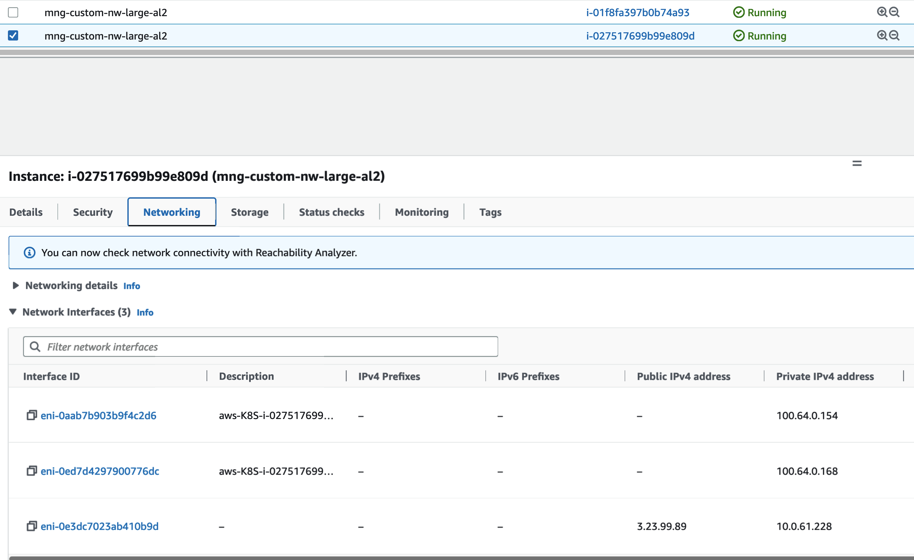

# Custom Networking on EKS
On Amazon EKS clusters, the default Container Networking Interface(CNI) is implemented by the Amazon VPC CNI plugin. When VPC CNI is used in EKS clusters, by default the VPC CNI assigns Pods an IP address that's selected from the primary subnet of the VPC. The primary subnet is the subnet CIDR that the primary Elastic Network Interface(ENI) is attached to; usually it's the subnet of the worker node/host in the EKS cluster. If the primary subnet CIDR is too small, the CNI may not be able to have enough IP addresses to assign to the Pods running in the cluster. This is a common challenge for EKS IPv4 clusters.

Custom Networking provides a solution to the IP exhaustion issue by assigning the Pod IPs from secondary VPC address spaces(CIDR). When custom networking is enabled in VPC CNI, it creates secondary ENIs in the subnet defined under a custom resource named ENIConfig that includes an alternate subnet CIDR range (carved from a secondary VPC CIDR). The VPC CNI assigns Pods IP addresses from the CIDR range defined in the ENIConfig Custom Resource Definition(CRD).

Using the Custom Networking with IPv4 pattern, you should be able to stand up an EKS cluster with VPC CNI installed and configured with custom networking enabled.


This pattern deploys the following resources:

- Creates EKS Cluster Control plane with a managed node group 
- Deploys supporting add-ons: VpcCni, CoreDns, KubeProxy
- Enables Custom Networking configuration in VpcCni AddOn 


## Prerequisites:

Ensure that you have installed the following tools on your machine.

1. [aws cli](https://docs.aws.amazon.com/cli/latest/userguide/install-cliv2.html)
2. [kubectl](https://Kubernetes.io/docs/tasks/tools/)
3. [cdk](https://docs.aws.amazon.com/cdk/v2/guide/getting_started.html#getting_started_install)
4. [npm](https://docs.npmjs.com/cli/v8/commands/npm-install)
5. [yq](https://github.com/mikefarah/yq/#install)

Amazon EKS add-ons are only available with Amazon EKS clusters running Kubernetes version 1.18 and later.

## Usage

This pattern  first creates Secondary CIDRs and Secondary Subnets with specified range of CIDRs as shown below in `resourceProvider` command. Then the VPC CNI addon sets up custom networking based on the parameters `awsVpcK8sCniCustomNetworkCfg`, `eniConfigLabelDef: "topology.kubernetes.io/zone"` for your Amazon EKS cluster workloads with created secondary subnet ranges. This way, when customers experience IP exhaustion in the Primary CIDR, they can use the Secondary CIDRs to assign IP addresses to the application Pods. 

Note: 
- When the secondary CIDRs are passed to the VPC resource provider, the secondary subnets are created and registered under names `secondary-cidr-subnet-${order}` with the resource providers.
- We enable CNI plugin with custom pod networking with environment variables
    -   AWS_VPC_K8S_CNI_CUSTOM_NETWORK_CFG = true
    -   ENI_CONFIG_LABEL_DEF = topology.kubernetes.io/zone
This deploys an `ENIConfig` custom resource for pod subnets (one per availability zone).

```typescript
import 'source-map-support/register';
import * as cdk from 'aws-cdk-lib';
import * as blueprints from '@aws-quickstart/eks-blueprints';

const app = new cdk.App();

const addOn = new blueprints.addons.VpcCniAddOn({
  customNetworkingConfig: {
      subnets: [
          blueprints.getNamedResource("secondary-cidr-subnet-0"),
          blueprints.getNamedResource("secondary-cidr-subnet-1"),
          blueprints.getNamedResource("secondary-cidr-subnet-2"),
      ]   
  },
  awsVpcK8sCniCustomNetworkCfg: true,
  eniConfigLabelDef: 'topology.kubernetes.io/zone'
});

const blueprint = blueprints.EksBlueprint.builder()
  .addOns(addOn)
  .resourceProvider(blueprints.GlobalResources.Vpc, new VpcProvider(undefined,"100.64.0.0/24",["100.64.0.0/25","100.64.0.128/26","100.64.0.192/26"],))
  .build(app, 'my-stack-name');
```


### Additional Configuration Options

Check the VPC CNI configuration that we installed in the above step with following command

```
$ kubectl describe daemonset aws-node -n kube-system | grep -A25 Environment                                                                                                                                                                                                                
    Environment:
      DISABLE_TCP_EARLY_DEMUX:  false
      ENABLE_IPv6:              false
    Mounts:
      /host/opt/cni/bin from cni-bin-dir (rw)
  Containers:
   aws-node:
    Image:      602401143452.dkr.ecr.us-east-2.amazonaws.com/amazon-k8s-cni:v1.12.5-eksbuild.2
    Port:       61678/TCP
    Host Port:  61678/TCP
    Requests:
      cpu:      25m
    Liveness:   exec [/app/grpc-health-probe -addr=:50051 -connect-timeout=5s -rpc-timeout=5s] delay=60s timeout=10s period=10s #success=1 #failure=3
    Readiness:  exec [/app/grpc-health-probe -addr=:50051 -connect-timeout=5s -rpc-timeout=5s] delay=1s timeout=10s period=10s #success=1 #failure=3
    Environment:
      ADDITIONAL_ENI_TAGS:                    {}
      ANNOTATE_POD_IP:                        false
      AWS_VPC_CNI_NODE_PORT_SUPPORT:          true
      AWS_VPC_ENI_MTU:                        9001
      AWS_VPC_K8S_CNI_CONFIGURE_RPFILTER:     false
      AWS_VPC_K8S_CNI_CUSTOM_NETWORK_CFG:     true
      AWS_VPC_K8S_CNI_EXTERNALSNAT:           false
      AWS_VPC_K8S_CNI_LOGLEVEL:               DEBUG
      AWS_VPC_K8S_CNI_LOG_FILE:               /host/var/log/aws-routed-eni/ipamd.log
      AWS_VPC_K8S_CNI_RANDOMIZESNAT:          prng
      AWS_VPC_K8S_CNI_VETHPREFIX:             eni
      AWS_VPC_K8S_PLUGIN_LOG_FILE:            /var/log/aws-routed-eni/plugin.log
      AWS_VPC_K8S_PLUGIN_LOG_LEVEL:           DEBUG
      CLUSTER_ENDPOINT:                       https://5D9E33C4F435A37D29A113DBA8AF9E1B.gr7.us-east-2.eks.amazonaws.com
      CLUSTER_NAME:                           custom-networking-ipv4-blueprint
      DISABLE_INTROSPECTION:                  false
      DISABLE_METRICS:                        false
      DISABLE_NETWORK_RESOURCE_PROVISIONING:  false
      ENABLE_IPv4:                            true
      ENABLE_IPv6:                            false
      ENABLE_POD_ENI:                         false
      ENABLE_PREFIX_DELEGATION:               false
      ENI_CONFIG_LABEL_DEF:                   topology.kubernetes.io/zone
      VPC_ID:                                 vpc-04e371c17ce0e9a55
      WARM_ENI_TARGET:                        1
```

We see from above that `ENI_CONFIG_LABEL_DEF` is set to "topology.kubernetes.io/zone" and `AWS_VPC_K8S_CNI_CUSTOM_NETWORK_CFG` is set to "true". This is expected from our CDK pattern as we passed these parameters to the VpcCniAddOn in the code snippet above.

- Prefix Delegation

Prefix Delegation is a property of Vpc Cni Plugin that allows customers to increase Pod density on an instance. 

Add more text

Without `prefix-delegation` enabled, an `m5.large` type instance can have 20 Pods running. With `prefix-delegation` enabled, this number increases to 110.

By default, Prefix Delegation is turned off in Vpc Cni. To check this, run the following command
```
kubectl get ds aws-node -o yaml -n kube-system | yq '.spec.template.spec.containers[].env'
```

Output:
```
[...]

- name: ENABLE_PREFIX_DELEGATION

  value: "false"

[...]
```

#### Testing the Pod scaling

Let's test the custom networking by deploying a sample workload.
```
$ kubectl create deployment nginx --image=nginx
deployment.apps/nginx created
Admin:~/environment $ kubectl scale --replicas=20 deployments/nginx
deployment.apps/nginx scaled
Admin:~/environment $ kubectl get pods -o wide
NAME                    READY   STATUS    RESTARTS   AGE   IP             NODE                                        NOMINATED NODE   READINESS GATES
nginx-8f458dc5b-2nf69   1/1     Running   0          19s   100.64.0.138   ip-10-0-61-228.us-east-2.compute.internal   <none>           <none>
nginx-8f458dc5b-2skzd   1/1     Running   0          19s   100.64.0.48    ip-10-0-18-208.us-east-2.compute.internal   <none>           <none>
nginx-8f458dc5b-47cl7   1/1     Running   0          19s   100.64.0.152   ip-10-0-61-228.us-east-2.compute.internal   <none>           <none>
nginx-8f458dc5b-5rk8j   1/1     Running   0          19s   100.64.0.167   ip-10-0-61-228.us-east-2.compute.internal   <none>           <none>
nginx-8f458dc5b-6dcvw   1/1     Running   0          19s   100.64.0.98    ip-10-0-18-208.us-east-2.compute.internal   <none>           <none>
nginx-8f458dc5b-8xz4g   1/1     Running   0          19s   100.64.0.172   ip-10-0-61-228.us-east-2.compute.internal   <none>           <none>
nginx-8f458dc5b-cq75m   1/1     Running   0          19s   100.64.0.165   ip-10-0-61-228.us-east-2.compute.internal   <none>           <none>
nginx-8f458dc5b-dp8kj   1/1     Running   0          19s   100.64.0.76    ip-10-0-18-208.us-east-2.compute.internal   <none>           <none>
nginx-8f458dc5b-ljhc4   1/1     Running   0          19s   100.64.0.183   ip-10-0-61-228.us-east-2.compute.internal   <none>           <none>
nginx-8f458dc5b-nqj7x   1/1     Running   0          19s   100.64.0.155   ip-10-0-61-228.us-east-2.compute.internal   <none>           <none>
nginx-8f458dc5b-q49kp   1/1     Running   0          19s   100.64.0.9     ip-10-0-18-208.us-east-2.compute.internal   <none>           <none>
nginx-8f458dc5b-rh6rn   1/1     Running   0          19s   100.64.0.36    ip-10-0-18-208.us-east-2.compute.internal   <none>           <none>
nginx-8f458dc5b-v548b   1/1     Running   0          40s   100.64.0.115   ip-10-0-18-208.us-east-2.compute.internal   <none>           <none>
nginx-8f458dc5b-w6jvc   1/1     Running   0          19s   100.64.0.99    ip-10-0-18-208.us-east-2.compute.internal   <none>           <none>
nginx-8f458dc5b-wgncz   1/1     Running   0          19s   100.64.0.27    ip-10-0-18-208.us-east-2.compute.internal   <none>           <none>
nginx-8f458dc5b-wjc9r   1/1     Running   0          19s   100.64.0.40    ip-10-0-18-208.us-east-2.compute.internal   <none>           <none>
nginx-8f458dc5b-x9t2p   1/1     Running   0          19s   100.64.0.162   ip-10-0-61-228.us-east-2.compute.internal   <none>           <none>
nginx-8f458dc5b-z4j87   1/1     Running   0          19s   100.64.0.161   ip-10-0-61-228.us-east-2.compute.internal   <none>           <none>
nginx-8f458dc5b-z9gcm   1/1     Running   0          19s   100.64.0.61    ip-10-0-18-208.us-east-2.compute.internal   <none>           <none>
nginx-8f458dc5b-zsj5l   1/1     Running   0          19s   100.64.0.142   ip-10-0-61-228.us-east-2.compute.internal   <none>           <none>
```

Also we can see that the Pods are assigned IP addresses from the secondary CIDR `100.64` range.


## Deploy EKS Cluster with Amazon EKS Blueprints for CDK

Clone the repository

```sh
git clone https://github.com/aws-samples/cdk-eks-blueprints-patterns.git
```

Updating npm

```sh
npm install -g npm@latest
```

To view patterns and deploy custom networking with ipv4 pattern

```sh
npm i
make build
cdk list
cdk bootstrap
cdk deploy custom-networking-ipv4-blueprint
```


## Verify the resources


Run update-kubeconfig command. You should be able to get the command from CDK output message. More information can be found at https://aws-quickstart.github.io/cdk-eks-blueprints/getting-started/#cluster-access
```sh
aws eks update-kubeconfig --name <your cluster name> --region <your region> 
```

Let’s verify the resources created by Steps above.

```sh
kubectl get node -o wide
```

```
NAME                                        STATUS   ROLES    AGE   VERSION                INTERNAL-IP   EXTERNAL-IP     OS-IMAGE         KERNEL-VERSION                  CONTAINER-RUNTIME
ip-10-0-18-208.us-east-2.compute.internal   Ready    <none>   70m   v1.24.11-eks-a59e1f0   10.0.18.208   18.116.23.237   Amazon Linux 2   5.10.173-154.642.amzn2.x86_64   containerd://1.6.19
ip-10-0-61-228.us-east-2.compute.internal   Ready    <none>   70m   v1.24.11-eks-a59e1f0   10.0.61.228   3.23.99.89      Amazon Linux 2   5.10.173-154.642.amzn2.x86_64   containerd://1.6.19
```

The worker nodes in the cluster still gets assigned an IP address from the Primary CIDR (10.0.0.0/16) range. However the Pods are assigned IP addresses from the Secondary CIDR(100.64.) ranges.

```sh
kubectl get eniconfig
```

```
NAME         AGE
us-east-2a   47m
us-east-2b   47m
us-east-2c   47m
```

Based on the VpcCniAddOn custom configuration, a separate ENIConfig CRD is created per availablity zone.

From the AWS Console, we can also check the ENIs that are assigned to the worker nodes.




## Cleanup

To clean up your EKS Blueprints, run the following commands:


```sh
cdk destroy custom-networking-ipv4-blueprint 
```

## Disclaimer 

