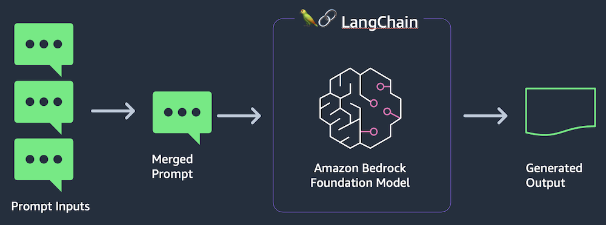

# Using Gen AI to run a prompt showcase with Bedrock and Amazon EKS

## Objective

[Amazon Bedrock](https://aws.amazon.com/bedrock/) is a fully managed service for using foundation models. It allows you to access models from Amazon and third parties with a single set of APIs for both text generation and image generation.

In this pattern we will demonstrate a prompt showcase with Gen AI using Bedrock and Amazon EKS. This usecase will demonstrate a prompt showcase which uses different prompt templates such as Summarization, Sentiment and Recommendation with user input to generate a response using Generative AI. In this model we will running a containerized application on Amazon EKS which integrates with Bedrock to provide required user response.

## Architecture



## Prerequisites

Ensure that you have installed the following tools on your machine:

- [aws cli](https://docs.aws.amazon.com/cli/latest/userguide/install-cliv2.html) (also ensure it is [configured](https://docs.aws.amazon.com/cli/latest/userguide/getting-started-quickstart.html#getting-started-quickstart-new))
- Bedrock is currently in preview. Please make sure your AWS account is enabled to use Bedrock
- [cdk](https://docs.aws.amazon.com/cdk/v2/guide/getting_started.html#getting_started_install)
- [npm](https://docs.npmjs.com/cli/v8/commands/npm-install)
- [tsc](https://www.typescriptlang.org/download)
- [make](https://www.gnu.org/software/make/)
- [Docker](https://docs.docker.com/get-docker/)

Let’s start by setting the account and region environment variables:

```sh
ACCOUNT_ID=$(aws sts get-caller-identity --query 'Account' --output text)
AWS_REGION=$(aws configure get region)
```

Clone the repository:

```sh
git clone https://github.com/aws-samples/cdk-eks-blueprints-patterns.git
cd cdk-eks-blueprints-patterns/lib/generative-ai/showcase/python
```
Create the ECR image repository and push the docker image to ECR for your showcase app:

```sh
IMAGE_NAME=bedrock-showcase
IMAGE_TAG=v2
aws ecr create-repository --repository-name $IMAGE_NAME
aws ecr get-login-password --region $AWS_REGION | docker login --username AWS --password-stdin $ACCOUNT_ID.dkr.ecr.$AWS_REGION.amazonaws.com
docker build -t $IMAGE_NAME .
docker tag bedrock-showcase:latest $ACCOUNT_ID.dkr.ecr.$AWS_REGION.amazonaws.com/$IMAGE_NAME:$IMAGE_TAG
docker push $ACCOUNT_ID.dkr.ecr.$AWS_REGION.amazonaws.com/$IMAGE_NAME:$IMAGE_TAG
cd ../../../../
```

## Deployment

If you haven't done it before, [bootstrap your cdk account and region](https://docs.aws.amazon.com/cdk/v2/guide/bootstrapping.html).

Set the pattern's parameters in the CDK context by overriding the _cdk.json_ file:

```sh
cat << EOF > cdk.json
{
    "app": "npx ts-node dist/lib/common/default-main.js",
    "context": {
        "bedrock.pattern.name": "showcase",
        "bedrock.pattern.namespace": "bedrock",
        "bedrock.pattern.image.name": "${ACCOUNT_ID}.dkr.ecr.$AWS_REGION.amazonaws.com/${IMAGE_NAME}",
        "bedrock.pattern.image.tag": "${IMAGE_TAG}
      }
}
EOF
```

Run the following commands:

```sh
make deps
make build
make pattern generative-ai-showcase deploy
```
When deployment completes, the output will be similar to the following:

```output
 ✅  generative-ai-showcase-blueprint

✨  Deployment time: 1287.16s

Outputs:
generative-ai-showcase-blueprint.generativeaishowcaseblueprintClusterNameA8D25DA0 = generative-ai-showcase-blueprint
generative-ai-showcase-blueprint.generativeaishowcaseblueprintConfigCommandC6A8442C = aws eks update-kubeconfig --name generative-ai-showcase-blueprint --region us-east-1 --role-arn arn:aws:iam::XXXXXXXXXX:role/generative-ai-showcase-bl-generativeaishowcaseblue-L18IUPGQ8M2I
generative-ai-showcase-blueprint.generativeaishowcaseblueprintGetTokenCommand5AE22878 = aws eks get-token --cluster-name generative-ai-showcase-blueprint --region us-east-1 --role-arn arn:aws:iam::XXXXXXXXXX:role/generative-ai-showcase-bl-generativeaishowcaseblue-L18IUPGQ8M2I
Stack ARN:
arn:aws:cloudformation:us-east-1:XXXXXXXXXX:stack/generative-ai-showcase-blueprint/cd2c4d90-5317-11ee-9c8d-0e69cfd9ba55

✨  Total time: 1290.99s
```

To see the deployed resources within the cluster, please run:

```sh
kubectl get pod,svc,secrets,ingress -A
```

A sample output is shown below:


Next, Navigate to the URL show under Ingress to see the below screen to interact with Generative AI showcase application by selecting different promptsand inputs and see the result :


## Next steps

You can go the [AWS Blog](https://aws.amazon.com/blogs/) to explore how to learn about [New Tools for Building with Generative AI on AWS](https://aws.amazon.com/blogs/machine-learning/announcing-new-tools-for-building-with-generative-ai-on-aws/). Also check on another blog our  on [Enabling Foundation Models to Complete Tasks With Agents for Amazon Bedrock](https://aws.amazon.com/blogs/aws/preview-enable-foundation-models-to-complete-tasks-with-agents-for-amazon-bedrock/). 

## Cleanup

To clean up your EKS Blueprints, run the following commands:

```sh
make pattern generative-ai-showcase destroy 
```
