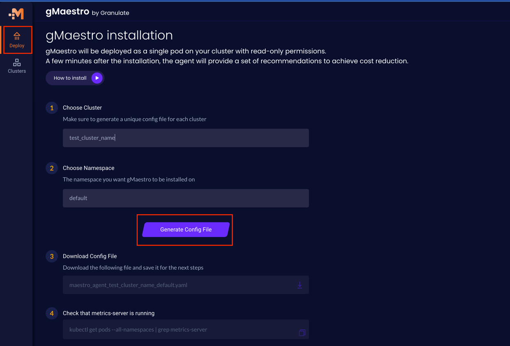
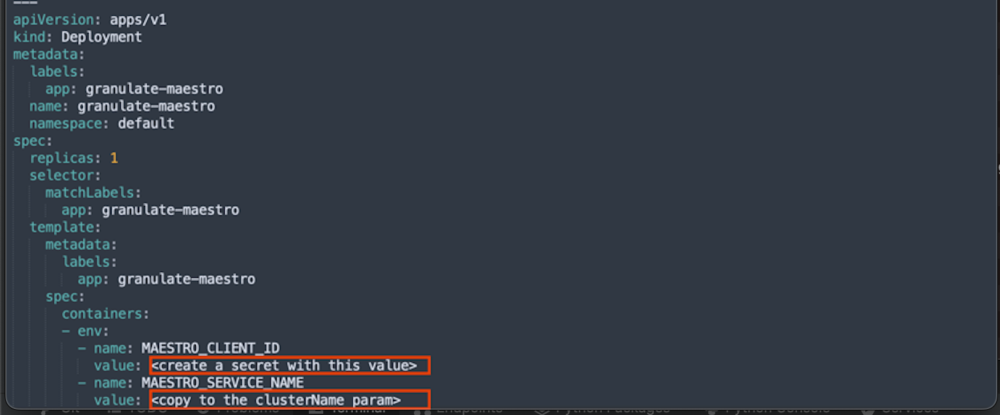
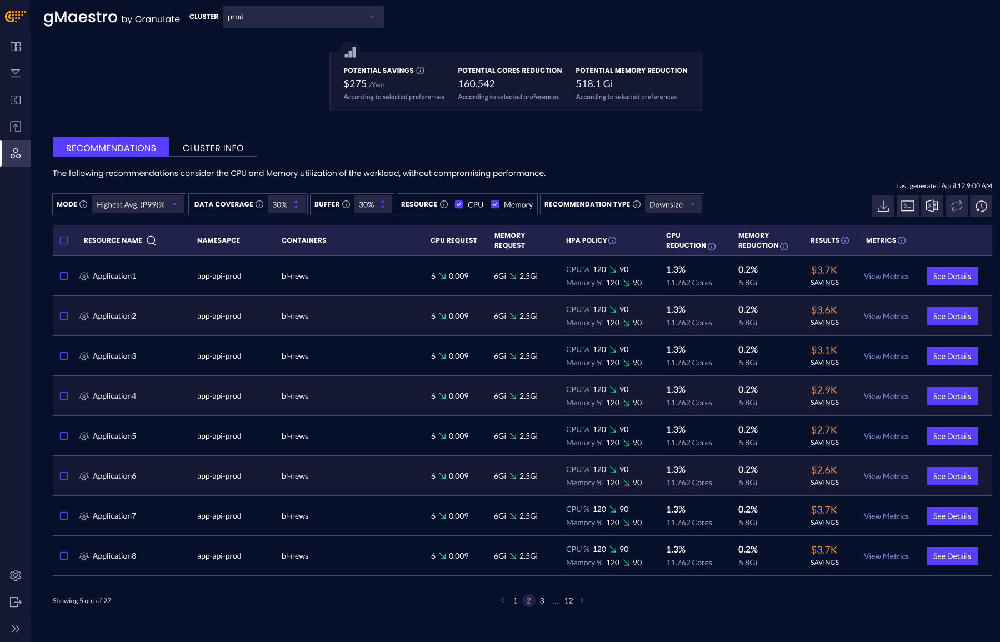

# gMaestro on EKS pattern

gMaestro is a Kubernetes cost optimization solution that helps companies reduce spending on un-utilized resources.
For additional information, visit [gMaestro documentation](https://gmaestro.gitbook.io/gmaestro-docs/).


This pattern deploys the following resources:
- Creates a single EKS cluster that includes a managed node group
- Deploys supporting add-ons: ClusterAutoScaler and MetricsServer
- Deploys a single granulate-gmaestro deployment with a single pod on the EKS cluster


## Prerequisites
Before using gMaestro, you need to:
1. [Sign up](https://app.granulate.io/gMaestroSignup) to the gMaestro platform
2. Download a config YAML file - After signing up to gMaestro, navigate to the [Deploy](https://app.granulate.io/deploy) on the left-hand menu, fill in the required fields and click on "Generate Config File" as shown bellow:





3. Create a secret (as a plaintext, not key/value) in AWS Secrets Manager:
    ```bash
    export MAESTRO_CLIENT_ID="<MAESTRO_CLIENT_ID value from the deployment section in the downloaded config file>"
    export MAESTRO_SECRET_NAME="<MAESTRO_SECRET_NAME your preferred secret name>"
    aws secretsmanager create-secret --name <MAESTRO_SECRET_NAME> --region $AWS_REGION \
        --description "Encrypted client ID for Granulate gMaestro" \
        --secret-string "<MAESTRO_CLIENT_ID>"
    ```

4. Follow the usage [instructions](../../README.md#usage) to install the dependencies
   
## Deployment

Clone the repository

```sh
git clone https://github.com/aws-samples/cdk-eks-blueprints-patterns.git
cd cdk-eks-blueprints-patterns
```

If you haven't done it before, [bootstrap your cdk account and region](https://docs.aws.amazon.com/cdk/v2/guide/bootstrapping.html).

Update `context` in `cdk.json` file located in the `cdk-eks-blueprints-patterns` directory as follows:

```json
"context": {
    "clusterName": "<MAESTRO_SERVICE_NAME value from the deployment section in the downloaded config file>",
    "namespace": "<Where gMaestro will be installed>",  
}
```

Run the following commands:

```sh
make deps
make build
make pattern gmaestro deploy
```

## Verify the resources

Use the following command to validate that gMaestro installed successfully:

```bash
$ kubectl get pods -A | grep granulate-maestro

NAMESPACE     NAME                                 READY   STATUS    RESTARTS   AGE
default       granulate-maestro-6947dc87bc-k5nfc   1/1     Running   0          11m
```

After a few seconds, you will gain full visibility into your K8s cluster objects:



The first rightsizing recommendations may take up to 5 minutes to load.

## Cleanup

To clean up your EKS Blueprints, run the following commands:

```sh
make pattern gmaestro destroy
```

## Support

If you have questions about gMaestro, catch us [on Slack](https://granulatecommunity.slack.com/archives/C03RK0HN2TU)!

## Disclaimer

This pattern relies on an open-source NPM package gmaestro-eks-blueprints-addon. Please refer to the package npm site for more information.
<https://www.npmjs.com/package/@granulate/gmaestro-eks-blueprints-addon>

If you have any questions about the npm package or find any defect, please post in the source repo at 
<https://github.com/Granulate/gmaestro-eks-blueprints-addon>