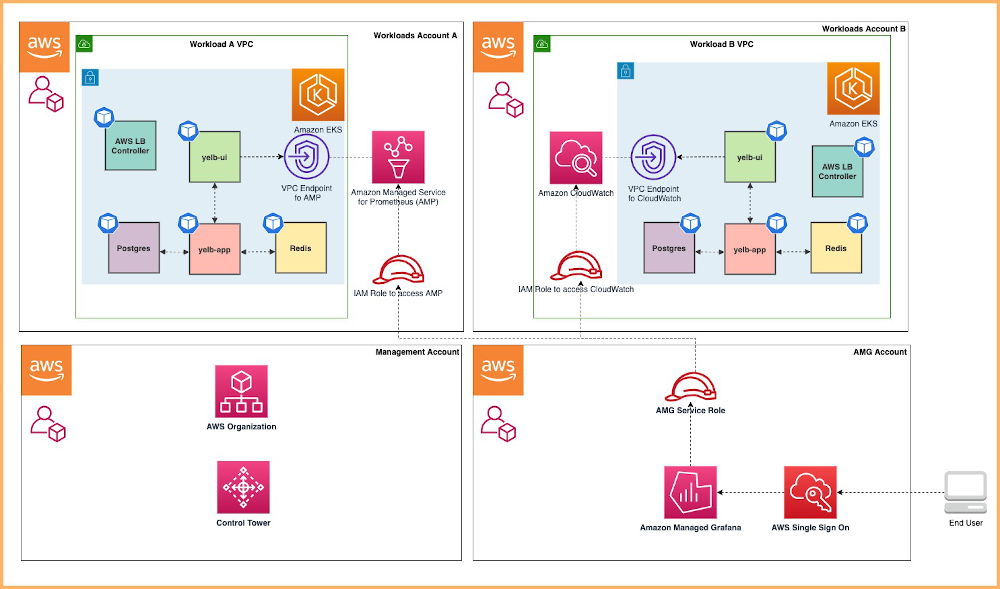

# Multi Account Open Source Observability Pattern.

## Architecture

The following figure illustrates the architecture of the pattern we will be deploying for Multi Account Observability pattern using open source tooling such as AWS Distro for Open Telemetry (ADOT), Amazon Managed Service for Prometheus (AMP), Amazon Managed Grafana :



## Objective

1. Deploying two production grade Amazon EKS cluster across 2 AWS Accounts ( Prod1, Prod2 account ) through a Continuous Deployment infrastructure pipeline triggered upon a commit to the repository that holds the pipeline configuration in an another AWS account (pipeline account).
2. Deploying ADOT add-on, AMP add-on to Prod 1 Amazon EKS Cluster to remote write metrics to AMP workspace in Prod 1 AWS Account. Deploying ADOT add-on, CloudWatch add-on to Prod 1 Amazon EKS Cluster to write metrics to CloudWatch in Prod 2 AWS Account.
3. Configuring GitOps tooling (ArgoCD addon) to support deployment of [ho11y](https://github.com/aws-observability/aws-o11y-recipes/tree/main/sandbox/ho11y) and [yelb](https://github.com/mreferre/yelb) sample applications, in a way that restricts each application to be deployed only into the team namespace, by using ArgoCD projects.
4. Setting up IAM roles in Prod 1 and Prod 2 Accounts to allow an AMG service role in the Monitoring account (4th AWS account) to access metrics from AMP workspace in Prod 1 account and CloudWatch namespace in Prod 2 account.
5. Setting Amazon Managed Grafana to visualize AMP metrics from Amazon EKS cluster in Prod account 1 and CloudWatch metrics on workloads in Amazon EKS cluster in Prod account 2.

### GitOps confguration

For GitOps, the blueprint bootstrap the ArgoCD addon and points to the [EKS Blueprints Workload](https://github.com/aws-samples/eks-blueprints-workloads) sample repository.

You can find the team-geordie configuration for this pattern in the workload repository under the folder [`team-geordie`](https://github.com/aws-samples/eks-blueprints-workloads/tree/main/teams/team-geordie).

## Prerequisites

1. AWS Control Tower deployed in your AWS environment in the management account. If you have not already installed AWS Control Tower, follow the [Getting Started with AWS Control Tower documentation](https://docs.aws.amazon.com/controltower/latest/userguide/getting-started-with-control-tower.html), or you can enable AWS Organizations in the AWS Management Console account and enable AWS SSO.
2. An AWS account under AWS Control Tower called Prod 1 Account(Workloads Account A aka prodEnv1) provisioned using the AWS Service Catalog Account Factory product AWS Control Tower Account vending process or AWS Organization.
3. An AWS account under AWS Control Tower called Prod 2 Account(Workloads Account B aka prodEnv2) provisioned using the AWS Service Catalog Account Factory product AWS Control Tower Account vending process or AWS Organization.
4. An AWS account under AWS Control Tower called Pipeline Account (aka pipelineEnv) provisioned using the AWS Service Catalog Account Factory product AWS Control Tower Account vending process or AWS Organization.
5. An AWS account under AWS Control Tower called Monitoring Account (Grafana Account aka monitoringEnv) provisioned using the AWS Service Catalog Account Factory product AWS Control Tower Account vending process or AWS Organization.

## Deploying

1. Fork this repository to your GitHub organisation/user
2. Clone your forked repository
3. Install the AWS CDK Toolkit globally on your machine using

    ```bash
    npm install -g aws-cdk
    ```

4. `github-ssh-key` - must contain GitHub SSH private key as a JSON structure containing fields `sshPrivateKey` and `url` in `pipelineEnv` account. This will be used by ArgoCD addon to authenticate against ay GitHub repository (private or public). The secret is expected to be defined in the region where the pipeline will be deployed to. For more information on SSH credentials setup see [ArgoCD Secrets Support](https://aws-quickstart.github.io/cdk-eks-blueprints/addons/argo-cd/#secrets-support).

5. `github-token` secret must be stored in AWS Secrets Manager for the GitHub pipeline in `pipelineEnv` account. For more information on how to set it up, please refer to the [docs](https://docs.aws.amazon.com/codepipeline/latest/userguide/GitHub-create-personal-token-CLI.html). The GitHub Personal Access Token should have these scopes:
   1. *repo* - to read the repository
   2. *admin:repo_hook* - if you plan to use webhooks (enabled by default)

6. `cdk-context` secret secret must be stored as a plain text in the following format in AWS Secrets Manager for cdk context for all the 4 AWS accounts used by the solution in `pipelineEnv` account..

    ```
    {
    "context": {
        "prodEnv1": {
            "account": "111111111111",
            "region": "your_region"
        },
        "prodEnv2": {
            "account": "222222222222",
            "region": "your_region"
        },
        "pipelineEnv": {
            "account": "333333333333",
            "region": "your_region"
        },
        "monitoringEnv": {
            "account": "444444444444",
            "region": "your_region"
        }
    }
    }
    ```
7. Create the following IAM users and attach `administrator` policy to required accounts.

    1. IAM user `pipeline-admin` with `administrator` in Pipeline AWS Account
    2. IAM user `prod1-admin` with `administrator` in Prod 1 AWS Account
    3. IAM user `prod2-admin` with `administrator` in Prod 2 AWS Account
    4. IAM user `mon-admin` with `administrator` in Monitoring AWS Account
    5. IAM user `team-geordi` in Prod 1 and Prod 2 AWS Account
    6. IAM user `team-platform` in Prod 1 and Prod 2 AWS Account

8. Install project dependencies by running `npm install` in the main folder of this cloned repository

9. Bootstrap your 4 AWS Accounts using [deploying pipelines approach] (https://aws-quickstart.github.io/cdk-eks-blueprints/pipelines/#deploying-pipelines) in this link. If you have bootstrap already done, please remove those before doing this step.

10. Modify the code in your forked repo to point to your GitHub username/organisation. This is needed because the AWS CodePipeline that will be automatically created will be triggered upon commits that are made in your forked repo. Open the [pattern file source code](../../lib/pipeline-multi-env-gitops/index.ts) and look for the declared const of `gitOwner`. Change it to your GitHub username.

11. Once all pre-requisites are set you are ready to deploy the pipeline. Run the following command from the root of this repository to deploy the pipeline stack:

```bash
make build
make pattern pipeline-multienv-monitoring deploy multi-account-central-pipeline
```

12. Now you can go to [AWS CodePipeline console](https://eu-west-1.console.aws.amazon.com/codesuite/codepipeline/pipelines), and see how it was automatically created to deploy multiple Amazon EKS clusters to different environments. 

11. The deployment automation will create `ampPrometheusDataSourceRole` with permissions to retrieve metrics from AMP in Prod 1 Account, `cloudwatchDataSourceRole` with permissions to retrieve metrics from CloudWatch in Prod 2 Account and `amgWorkspaceIamRole` in monitoring account to assume roles in Prod 1 and Prod 2 account for retrieving and visualizing metrics in Grafana.

12. Next, manually follow the following steps from [AWS Open Source blog](https://aws.amazon.com/blogs/opensource/setting-up-amazon-managed-grafana-cross-account-data-source-using-customer-managed-iam-roles/#:~:text=AWS%20SSO%20in%20the%20management%20account) :
    1. AWS SSO in the management account
    2. Query metrics in Monitoring account from Amazon Managed Prometheus workspace in Prod 1 Account
    3. Query metrics in the Monitoring account from Amazon CloudWatch in Prod 1 Account


### Validating Custom Metrics and Traces from ho11y App

1. Run the below command in both clusters to generate traces to X-Ray and Amazon Managed Grafana Console out the sample `ho11y` app :

```
frontend_pod=`kubectl get pod -n geordie --no-headers -l app=frontend -o jsonpath='{.items[*].metadata.name}'`
loop_counter=0
while [ $loop_counter -le 5000 ] ;
do
        kubectl exec -n geordie -it $frontend_pod -- curl downstream0.geordie.svc.cluster.local;
        echo ;
        loop_counter=$[$loop_counter+1];
done
```
### Traces and Service Map screenshots from X-Ray Console


### Custom Metrics from ho11y App on Amazon Managed Grafana Console using AMP as data source


### Custom Metrics from ho11y App on Amazon Managed Grafana Console using CloudWatch as data source


### Notes

This pattern consumes multiple Elastic IP addresses, because 3 VPCs with 3 subnets are created by this pattern in Prod 1 and Prod 2 AWS Accounts. Make sure your account limits for EIP are increased to support additional 9 EIPs (1 per Subnets).

