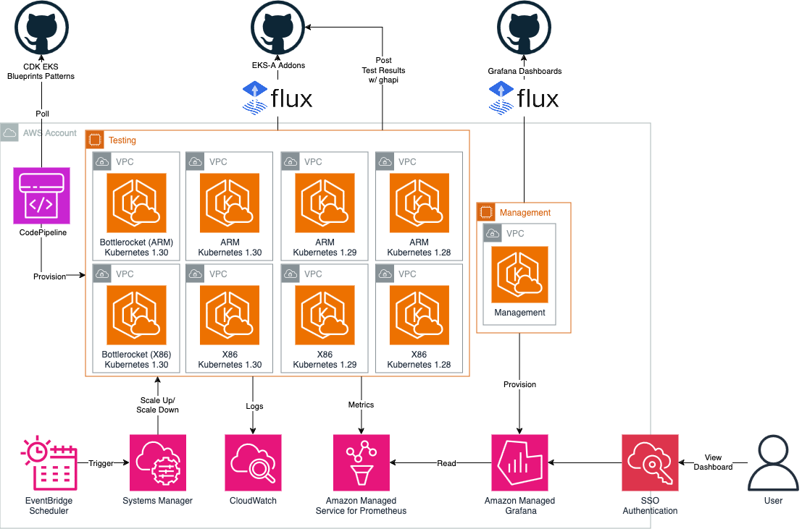
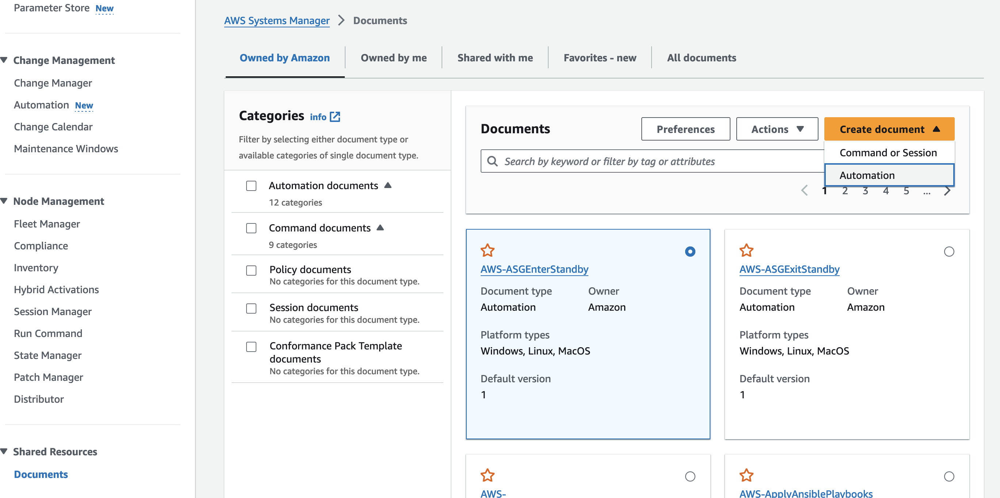
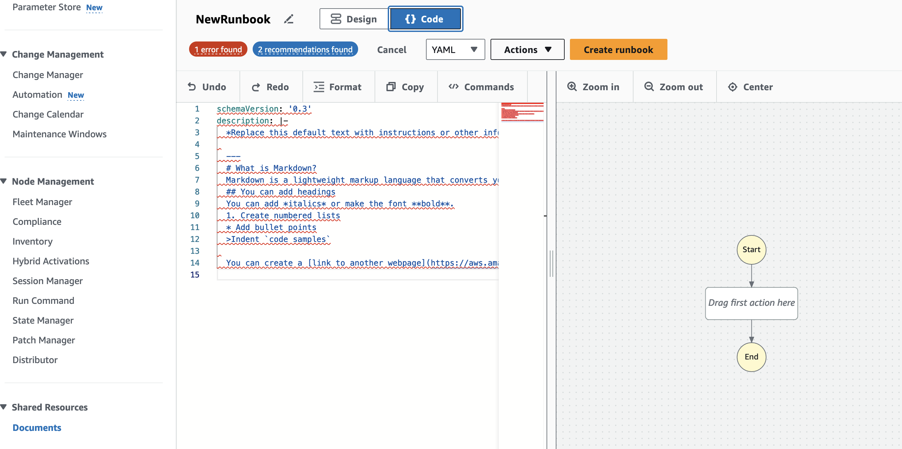
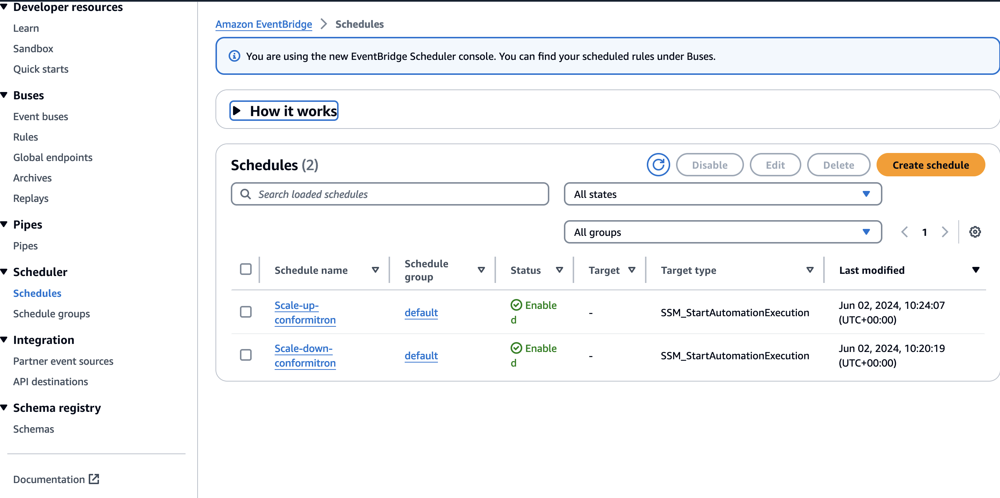
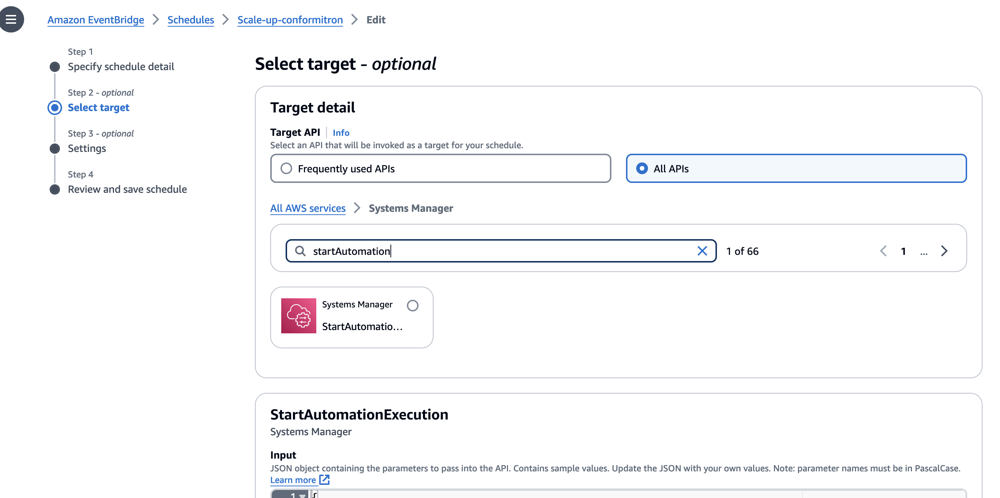

# Multi-cluster pattern with observability, cost optimizations and metrics aggregation

## Objective

This pattern was started to solve a problem faced at AWS. We often get third-party software for validation and need a consistent automated approach to run Kubernetes evaluator testing, deployment of containerized products, and validation in Kubernetes environments on a variety of Amazon EKS environments. 

In this pattern we:

1. Automate deployment of multiple EKS cluster in a region, with a Continuous Deployment pipeline triggered upon a commit to the GitHub repository that hosts the pipeline configuration.

1. Configure the EKS clusters to deploy with different architectures (x86 or ARM or Bottlerocket) and different Kubernetes versions (3 most recent by default).

1. Automate testing of all the available [EKS Anywhere Addons](https://github.com/aws-samples/eks-anywhere-addons), on each of the clusters, essentially testing their compatibility across all the potential architecture/version available today on AWS. 

1. Deploying this pattern 24x7 we observed high costs (300$ a day). By using the AWS Systems Manager Automations and AutoScaling Groups we scale-down to zero during non-business hours resulting in 60% cost savings. We also borrowed optimized OTEL collector configurations from  [CDK Observability Accelerator](https://github.com/aws-observability/cdk-aws-observability-accelerator) to further reduce Prometheus storage costs. 

To learn more about our EKS Addon validation checkout our [blog](https://aws.amazon.com/blogs/containers/conformitron-validate-third-party-software-with-amazon-eks-and-amazon-eks-anywhere/)



### GitOps confguration

GitOps is a branch of DevOps that focuses on using Git code repositories to manage infrastructure and application code deployments.

For this pattern there is a git driven deployment using GitHub and Codepipeline which automatically redploys the EKS Clusters when modifications are made to the GitHub repo. 

Secondly, for the deployment of workloads on the cluster we leverage FluxCD, this a GitOps approach for the workloads i.e. the third-party-software we want to validate on our hardware.

We require some additional secrets to be created in Secrets Manager for the pattern to function properly

1. AWS CodePipeline Bootstrap - The AWS CodePipeline points to the GitHub fork of this repository i.e [cdk-eks-blueprint-patterns] (https://github.com/aws-samples/cdk-eks-blueprints-patterns). 

A `github-token` secret must be stored in AWS Secrets Manager for the CodePipeline to access the webhooks on GitHub. For more information on how/why to set it up, please refer to the [docs](https://docs.aws.amazon.com/codepipeline/latest/userguide/GitHub-create-personal-token-CLI.html). The GitHub Personal Access Token should have these scopes:
   1. *repo* - to read your forked cdk-blueprint-patterns repostiory
   1. *admin:repo_hook* - if you plan to use webhooks (enabled by default)

1. FluxCD Bootstrap - The FluxCD points to the [EKS Anywhere Addons](https://github.com/aws-samples/eks-anywhere-addons) repository. Since this is a public repository you will not need to add a github token to read it.

 As part of the FluxCD configuration, it uses Kustomize to apply all the addons that are in the repository along with deploying their functional tests and a custom validator cronJob.


## Prerequisites
Start by setting the account and region environment variables:

```sh
ACCOUNT_ID=$(aws sts get-caller-identity --query 'Account' --output text)
AWS_REGION=$(aws configure get region)
```
1. In case you haven't done this before, bootstrap your AWS Account for AWS CDK use using:

    ```bash
    cdk bootstrap
    ```

1. Fork this repository (cdk-eks-blueprints-patterns) to your GitHub organisation/user
1. Git clone your forked repository onto your machine
1. Install the AWS CDK Toolkit globally on your machine using

    ```bash
    npm install -g aws-cdk@2.133.0
    ```

1. Increase AWS service quota for required resources, navigate to [Service Quota Tutorial](https://aws.amazon.com/getting-started/hands-on/request-service-quota-increase/) to learn more
```
   SERVICE                                   | QUOTA NAME                         | REQUESTED QUOTA
   Amazon Virtual Private Cloud (Amazon VPC) | NAT gateways per Availability Zone | 30 
   Amazon Virtual Private Cloud (Amazon VPC) | VPCs per region                    | 30
   Amazon Elastic Compute Cloud (Amazon EC2) | EC2-VPC Elastic IPs                | 30
```
We are using seperate VPC as a best practice, but you can use default vpc if you prefer. Also, If you decide to use different regions for each cluster you dont need quota increase, please reach out if you have need for this use case.

1. Amazon Managed Grafana Workspace: To visualize metrics collected, you need an Amazon Managed Grafana workspace. If you have an existing workspace, create environment variables `AMG_ENDPOINT_URL` as described below. 

Else, to create a new workspace, visit and run our [supporting example for Grafana Deployment](https://aws-observability.github.io/terraform-aws-observability-accelerator/helpers/managed-grafana/)

```bash
export AMG_ENDPOINT_URL=https://g-xxx.grafana-workspace.region.amazonaws.com
export AMG_WORKSPACE_ID=g-xxx
```

1. Grafana API Key: Amazon Managed Grafana provides a control plane API for generating Grafana API keys or Service Account Tokens. This allows programatic provisioning of Grafana dashboards using the EKS grafana operator.

=== "v9.4 and greater workspaces "

    ```bash
    # IMPORTANT NOTE: skip this command if you already have a service token
    GRAFANA_SA_ID=$(aws grafana create-workspace-service-account \
      --workspace-id $AMG_WORKSPACE_ID \
      --grafana-role ADMIN \
      --name cdk-accelerator-eks \
      --query 'id' \
      --output text)

    # creates a new token
    export AMG_API_KEY=$(aws grafana create-workspace-service-account-token \
      --workspace-id $AMG_WORKSPACE_ID \
      -name "grafana-operator-key" \
      --seconds-to-live 432000 \
      --service-account-id $GRAFANA_SA_ID \
      --query 'serviceAccountToken.key' \
      --output text)
    ```

=== "v8.4 workspaces"

    ```bash
    export AMG_API_KEY=$(aws grafana create-workspace-api-key \
      --key-name "grafana-operator-key" \
      --key-role "ADMIN" \
      --seconds-to-live 432000 \
      --workspace-id $AMG_WORKSPACE_ID \
      --query key \
      --output text)
    ```

1. AWS SSM Parameter Store for GRAFANA API KEY: Update the Grafana API key secret in AWS SSM Parameter Store using the above new Grafana API key. This will be referenced by Grafana Operator deployment of our solution to access and provision Grafana dashboards from Amazon EKS monitoring Cluster

```bash
aws ssm put-parameter --name "/grafana-api-key" \
    --type "SecureString" \
    --value $AMG_API_KEY \
    --region $AWS_REGION
```

1. Amazon Managed Prometheus Workspace: To store observability metrics from all clusters we will use Amazon Managed Prometheus due to it's ease of setup and easy integration with other AWS services. We recommend setting up a new seperate Prometheus workspace using the CLI commands below. The provisioning of a new AMP workspace can be automated by leveraging the `.resourceProvider` in our CDK blueprints. See [Example](https://github.com/aws-observability/cdk-aws-observability-accelerator/blob/main/lib/existing-eks-opensource-observability-pattern/index.ts). We intentionally left this out to allow to connecting with existing AMP deployments, but please reach out to us if you need guidance on automate this provisioning.

```bash
aws amp create-workspace --alias conformitron
```

Copy the `workspaceID` from the output and export it as a variable

```bash
export AMP_WS_ID=ws-xxxxxxx-xxxx-xxxx-xxxx-xxxxxx
```


1. Modify the code in your forked repo to point to your GitHub username/organisation. Open the [pattern file source code](../../lib/multi-cluster-construct/pipeline.ts) and look for the declared const of `gitOwner`. Change it to your GitHub username.


## Deploying

Clone the repository:

```sh
git clone https://github.com/aws-samples/cdk-eks-blueprints-patterns.git
cd cdk-eks-blueprints-patterns
```

Set the pattern's parameters in the CDK context by overriding the _cdk.json_ file (edit _PARENT_DOMAIN_NAME_ as it fits):
```sh
cat << EOF > cdk.json
{
    "app": "npx ts-node dist/lib/common/default-main.js",
    "context": {
        "conformitron.amp.endpoint": "https://aps-workspaces.${AWS_REGION}.amazonaws.com/workspaces/${AMP_WS_ID}/",
        "conformitron.amp.arn":"arn:aws:aps:${AWS_REGION}:${ACCOUNT_ID}:workspace/${AMP_WS_ID}",
        "conformitron.amg.endpoint": "${AMG_ENDPOINT_URL}",
        "conformitron.version": ["1.28","1.29","1.30"]
      },
      "fluxRepository": {
      "name": "grafana-dashboards",
      "namespace": "grafana-operator",
      "repository": {
        "repoUrl": "https://github.com/aws-observability/aws-observability-accelerator",
        "name": "grafana-dashboards",
        "targetRevision": "main",
        "path": "./artifacts/grafana-operator-manifests/eks/infrastructure"
      },
      "values": {
        "GRAFANA_CLUSTER_DASH_URL" : "https://raw.githubusercontent.com/aws-observability/aws-observability-accelerator/main/artifacts/grafana-dashboards/eks/infrastructure/cluster.json",
        "GRAFANA_KUBELET_DASH_URL" : "https://raw.githubusercontent.com/aws-observability/aws-observability-accelerator/main/artifacts/grafana-dashboards/eks/infrastructure/kubelet.json",
        "GRAFANA_NSWRKLDS_DASH_URL" : "https://raw.githubusercontent.com/aws-observability/aws-observability-accelerator/main/artifacts/grafana-dashboards/eks/infrastructure/namespace-workloads.json",
        "GRAFANA_NODEEXP_DASH_URL" : "https://raw.githubusercontent.com/aws-observability/aws-observability-accelerator/main/artifacts/grafana-dashboards/eks/infrastructure/nodeexporter-nodes.json",
        "GRAFANA_NODES_DASH_URL" : "https://raw.githubusercontent.com/aws-observability/aws-observability-accelerator/main/artifacts/grafana-dashboards/eks/infrastructure/nodes.json",
        "GRAFANA_WORKLOADS_DASH_URL" : "https://raw.githubusercontent.com/aws-observability/aws-observability-accelerator/main/artifacts/grafana-dashboards/eks/infrastructure/workloads.json"
      },
      "kustomizations": [
        {
          "kustomizationPath": "./artifacts/grafana-operator-manifests/eks/infrastructure"
        }
      ]
    }
}
EOF
```

You are now ready to deploy the pipeline. Run the following command from the root of this repository to deploy the pipeline stack:

```bash
make pattern multi-cluster-conformitron deploy multi-cluster-central-pipeline
```

Now you can go to [AWS CodePipeline console](https://eu-west-1.console.aws.amazon.com/codesuite/codepipeline/pipelines), and see how it was automatically created to deploy multiple Amazon EKS clusters to different environments.


# SSM Cost Optimizations for conformitron clusters

Running all the clusters by default for 24 hours results in a daily spend of $300+

To minimize these costs we have written a systems manager automation which automatically scales down autoscaling group to 0 desired nodes during off-business hours.

On weekdays 5 PM PST clusters are scaled to 0 -> CRON EXPRESSION:  `0 17 ? * MON-FRI *`
On weekdays 5 AM PST clusters are scaled to 1 -> CRON EXPRESSION:  `0 05 ? * MON-FRI *`
On weekends clusters stay scaled to 0.

These optimizations bring down the weekly cost to less than 1000$ essentially for a more than 60% cost savings.

Please find the SSM Automation documents `lib/multi-cluster-construct/resources/cost-optimization/scaleDownEksToZero.yml` and `lib/multi-cluster-construct/resources/cost-optimization/scaleUpEksToOne.yml`. 

Lets take a look at one of the scripts `scaleDownEksToZero.yml`

```yaml
schemaVersion: '0.3'
...
...
mainSteps:
  ...
  ...
    inputs:
      Service: eks
      Api: UpdateNodegroupConfig      <---- Update the managed node group 
      clusterName: arm-1-26-blueprint <---- Modify according to your naming convention
      nodegroupName: eks-blueprints-mng
      scalingConfig:
        minSize: 0                    <---- New Scaling Configuration
        maxSize: 1
        desiredSize: 0                <---- Scale To zero
```
By triggering this automation at 5PM on Weekdays we automatically scale down clusters during off-hours.

To run these scripts first you will have to modify update them with your own account_ID
We will use `sed` command to automatically update the files
```bash
sed "s/ACCOUNT_ID/$ACCOUNT_ID/g" scaleDownEksToZero.yml > scaleDownEksToZeroNew.yml
sed "s/ACCOUNT_ID/$ACCOUNT_ID/g" scaleUpEksToOne.yml > scaleUpEksToOneNew.yml
```

1. Then navigate to the Systems Manager > Documents and Create a new Automation.



1. Click on JSON and copy over the yml content to create a new runbook



1. Once saved, navigate to EventBridge > Scheduler > Schedules



1. Create a new schedule with the CRON expression specified aboce


1. For Target select "StartAutomationExecution" and type in the document name from step 2



