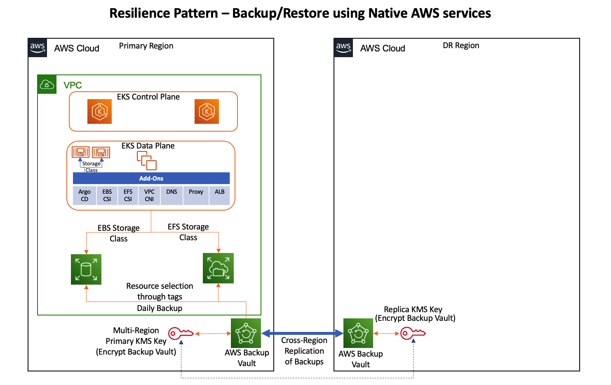
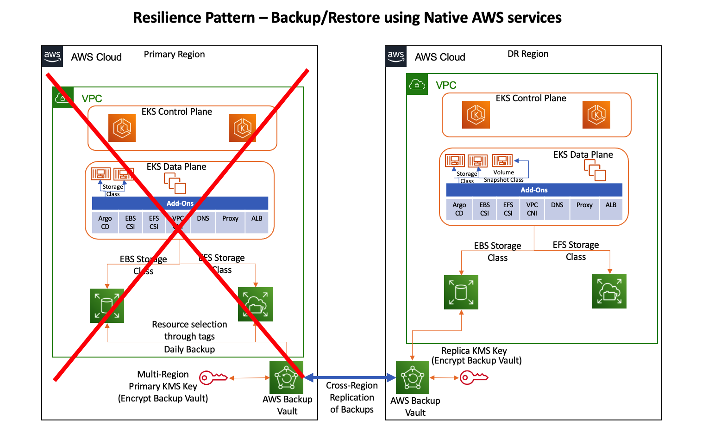

# Using AWS Native services to setup a Backup/Restore Disaster Recovery pattern for EKS 

## Objective

Resiliency is the ability of your system to react to failure and still remain functional.
A resilient system can withstand and recover from disruptions more quickly, resulting in a shorter recovery time and less downtime. Amazon Elastic Kubernetes Service (EKS) is a regional service that span’s across multiple availability zones. However in case of regional outages applications hosted on EKS will become un-available. And the best practice is to design multi-regional architectures. 

Multi-region architectures comes with a cost and not all applications will require an immediate failover to Disaster Recovery region in case of regional outages. The Disaster recovery architecture is driven by two major requirements highlighted below. 

1/ Recovery Time Objective (RTO) - The maximum acceptable delay between the interruption of service and restoration of service. This determines what is considered an acceptable time window when service is unavailable.

2/ Recovery Point Objective (RPO) - The maximum acceptable amount of time since the last data recovery point. This determines what is considered an acceptable loss of data between the last recovery point and the interruption of service.

And a non-critical application will have a higher RTO and RPO and will not need an immediate failover to Disaster recovery region in-case of regional outages. 

The Objective of this pattern is to provide a reference design for a Disaster Recovery Architecture for a non-critical application with higher RTO and RPO using AWS native services. 

This page has details of setting up the EKS cluster on the primary region with configuration to backup Dataplane Nodes, EBS Volumes and EFS Filesystems. 

## Architecture



The repository provides a CDK(Cloud Development Kit) code that provisions the following components 

VPC – Provisions a VPC spread across 2 Availability Zones that has 2 Public Subnets, 2 Private Subnets , 2 NAT Gateways and Route tables. The code leverages eks-blueprints to provision the VPC. 

EKS Cluster – A EKS Cluster is provisioned across 2 availability zones in the primary region. 

AddOns – The code leverages eks-blueprint to provision the Add-Ons during EKS Cluster bootstrapping 
•	ArgoCD – ArgoCD is a deployed into the cluster for GitOps capability and it is also used to provision Kubernetes storage classes for EBS and EFS. The EBS storage class has definition to add tags to EBS Volumes that are provisioned and these tags are used in AWS Backup Plan. 

•	EBS CSI – EBS CSI is deployed into the cluster for Dynamic Storage provisioning 

•	EFS CSI – EFS CSI is deployed into the cluster for Static Storage provisioning 

•	Amazon VPC CNI is deployed into the cluster to support native AWS VPC networking for Amazon EKS

•	CoreDNS is deployed into the cluster. CoreDns is a flexible, extensible DNS server that can serve as the Kubernetes cluster DNS

•	KubeProxy is deployed into the cluster to maintains network rules on each Amazon EC2 node

•	ALB Controller is deployed into the cluster to expose your applications to the outside world. 

Managed Node Groups : The code deploys a Managed Node Group using Generic Cluster provider module of EKS blueprints. The Nodes are tagged and the tags are configured in AWS Backup plan to be included in the backups. 

KMS Keys: Multi-region KMS key , Replica in DR region and Alias are created and used to encrypt the Backup Vault. 

Primary Backup Vault: Primary Backup vault is created in the Primary region and encrypted with KMS Key , A Backup Plan with schedule and copy action defined to run backup at specified schedule and copy the backups to the DR Backup vault. The resources are selected based on the tags attached to them during provisioning. 

DR Backup Vault: DR Backup vault is created in the DR region and encrypted with the KMS Key Replica. 

## Prerequisites

Ensure that you have installed the following tools on your machine:

- [aws cli](https://docs.aws.amazon.com/cli/latest/userguide/install-cliv2.html) rted_install)
- [npm](https://docs.npmjs.com/cli/v8/commands/npm-install)
- [tsc](https://www.typescriptlang.org/download)
- [make](https://www.gnu.org/software/make/)
- [Docker](https://docs.docker.com/get-docker/)

Let’s start by setting the account and region environment variables:

```sh
ACCOUNT_ID=$(aws sts get-caller-identity --query 'Account' --output text)
AWS_REGION=$(aws configure get region)
```

Clone the repository:

```sh
git clone https://github.com/aws-samples/cdk-eks-blueprints-patterns.git

```

## Deployment

If you haven't done it before, [bootstrap your cdk account and region](https://docs.aws.amazon.com/cdk/v2/guide/bootstrapping.html).

Set the pattern's parameters in the CDK context by overriding the _cdk.json_ file (Update the values for variables based on your environment):

```sh
cat << EOF > cdk.json
{
    "app": "npx ts-node dist/lib/common/default-main.js",
    "context": {
        "resilience-backup-restore-aws.pattern.name": "resilience_backup_restore_aws",
        "resilience-backup-restore-aws.primary.region": "us-west-1",
        "resilience-backup-restore-aws.dr.region": "us-east-2",
        "resilience-backup-restore-aws.efs.fsname": "efs-test",
        "resilience-backup-restore-aws.backup.vaultname": "eks-vault"
      }
}
EOF
```

Run the following commands:

```sh
make deps
make build
make pattern resilience-br-backup-aws "deploy --all"
```
When deployment completes, the output will be similar to the following:

```output
  ✅  eks-blueprint 

✨  Deployment time: 1.55s

Outputs:
eks-blueprint.EfsFileSystemId = fs-0eb944ebcc8fc4218
eks-blueprint.ExportsOutputFnGetAttKMSKeyArn3349B39A = arn:aws:kms:us-west-1:XXXXXXXXXXXX:key/mrk-01f5fa48358f41048981abc60e2f7d2e
eks-blueprint.eksblueprintClusterNameF2A3938C = eks-blueprint
eks-blueprint.eksblueprintConfigCommandC5F2ABDA = aws eks update-kubeconfig --name eks-blueprint --region us-west-1 --role-arn arn:aws:iam::XXXXXXXXXXXX:role/eks-blueprint-eksblueprintAccessRoleBA6A9CB7-Fu9TnULIf5O6
eks-blueprint.eksblueprintGetTokenCommandD17B69F1 = aws eks get-token --cluster-name eks-blueprint --region us-west-1 --role-arn arn:aws:iam::XXXXXXXXXXXX:role/eks-blueprint-eksblueprintAccessRoleBA6A9CB7-Fu9TnULIf5O6
```

To see the deployed resources within the cluster, please run:

```sh
aws eks update-kubeconfig --name eks-blueprint --region us-west-1 --role-arn arn:aws:iam::XXXXXXXXXXXX:role/eks-blueprint-eksblueprintAccessRoleBA6A9CB7-Fu9TnULIf5O6  # Command Copied from the Stack output
kubectl get sc 
```

A sample output is shown below:

```output
NAME            PROVISIONER             RECLAIMPOLICY   VOLUMEBINDINGMODE      ALLOWVOLUMEEXPANSION   AGE
aws-ebs-sc      ebs.csi.aws.com         Delete          Immediate              false                  50m
efs-sc          efs.csi.aws.com         Delete          Immediate              false                  50m
gp2 (default)   kubernetes.io/aws-ebs   Delete          WaitForFirstConsumer   false                  100m
```

Ensure that the Storage classes aws-ebs-sc and efs-sc are configured during bootstrap by ArgoCD. 

Sample Application Defintion : https://github.com/aws-samples/eks-blueprints-workloads/tree/main/teams/team-rbraws/SampleApp

## Disaster Recovery Procedure

High-level process to recovery your application during a disaster is outlined here




### [Step 1:] 

Setup an EKS cluster on the Disaster Recovery region

Let’s start by setting the account and region environment variables:

```sh
ACCOUNT_ID=$(aws sts get-caller-identity --query 'Account' --output text)
AWS_REGION=$(aws configure get region)
```

Clone the repository:

```sh
git clone https://github.com/aws-samples/cdk-eks-blueprints-patterns.git

```

If you haven't done it before, [bootstrap your cdk account and region](https://docs.aws.amazon.com/cdk/v2/guide/bootstrapping.html).

Set the pattern's parameters in the CDK context by overriding the _cdk.json_ file (Update the values for variables based on your environment): 

```sh
cat << EOF > cdk.json
{
    "app": "npx ts-node dist/lib/common/default-main.js",
    "context": {
        "resilience-backup-restore-aws.pattern.name": "resilience_backup_restore_aws",
        "resilience-backup-restore-aws.primary.region": "us-west-1",
        "resilience-backup-restore-aws.dr.region": "us-east-2",
        "resilience-backup-restore-aws.efs.fsname": "efs-test",
        "resilience-backup-restore-aws.backup.vaultname": "eks-vault"
      }
}
EOF
```

Run the following commands:

```sh
make deps
make build
make pattern resilience-br-restore-aws "deploy --all"
```
When deployment completes, the output will be similar to the following:

```output
  ✅  eks-blueprint 

✨  Deployment time: 1.55s

Outputs:
eks-blueprint.EfsFileSystemId = fs-0eb944ebcc8fc4218
eks-blueprint.ExportsOutputFnGetAttKMSKeyArn3349B39A = arn:aws:kms:us-west-1:XXXXXXXXXXXX:key/mrk-01f5fa48358f41048981abc60e2f7d2e
eks-blueprint.eksblueprintClusterNameF2A3938C = eks-blueprint
eks-blueprint.eksblueprintConfigCommandC5F2ABDA = aws eks update-kubeconfig --name eks-blueprint --region us-west-1 --role-arn arn:aws:iam::XXXXXXXXXXXX:role/eks-blueprint-eksblueprintAccessRoleBA6A9CB7-Fu9TnULIf5O6
eks-blueprint.eksblueprintGetTokenCommandD17B69F1 = aws eks get-token --cluster-name eks-blueprint --region us-west-1 --role-arn arn:aws:iam::XXXXXXXXXXXX:role/eks-blueprint-eksblueprintAccessRoleBA6A9CB7-Fu9TnULIf5O6
```

To see the deployed resources within the cluster, please run:

```sh
aws eks update-kubeconfig --name eks-blueprint --region us-west-1 --role-arn arn:aws:iam::XXXXXXXXXXXX:role/eks-blueprint-eksblueprintAccessRoleBA6A9CB7-Fu9TnULIf5O6  # Command Copied from the Stack output
kubectl get sc 
```

A sample output is shown below:

```output
NAME            PROVISIONER             RECLAIMPOLICY   VOLUMEBINDINGMODE      ALLOWVOLUMEEXPANSION   AGE
aws-ebs-sc      ebs.csi.aws.com         Delete          Immediate              false                  50m
efs-sc          efs.csi.aws.com         Delete          Immediate              false                  50m
gp2 (default)   kubernetes.io/aws-ebs   Delete          WaitForFirstConsumer   false                  100m
```

```sh
kubectl get volumesnapshotclass
```

```output
NAME                   DRIVER            DELETIONPOLICY   AGE
ebs-volume-snapclass   ebs.csi.aws.com   Delete           3h9m
```

Next, Ensure that the Storage classes aws-ebs-sc, efs-sc and Volumesnapshot class ebs-volume-snapclass are configured during bootstrap by ArgoCD. 

The pattern creates a AWS Backup Vault in both the primary and disaster recovery regions and configures cross region replication for all the backups in the vault. 

High-level process to recovery your application during a disaster is outlined here

### [Step 2:] 
Download the Manifest files to a Local folder in your Admin Machine which has access to the EKS Cluster. 

Sample Application Defintion : https://github.com/aws-samples/eks-blueprints-workloads/tree/main/teams/team-rbraws/SampleApp

_Note:_ PersistentVolumeClaim Manifests are updated inline in the next steps; Ensure that you have a backup of all your Manifest files before proceeding further. 

### [Step 3:] 

#### If your application was using an EBS volume as a persistent volume then follow the below steps 

Run the Script to create VolumeSnapshotContent ; VolumeSnapshot from the latest snapshot of the EBS Volume (Used by Application in Primary Region) and Modify PersistentVolumeClaim to reference the VolumeSnapshot.

```sh
cdk-eks-blueprints-patterns/lib/resilience/backup_restore/restore/aws/scripts/update_pvc.sh <Local Manifest Folder absolute path> (eg: update_pvc.sh /data/manifest)"

```

#### If your application was using an EFS Volume as a persistent volume then follow the process outlined in the document below to restore the filesystem from the latest EFS snapshot
``` sh
https://docs.aws.amazon.com/aws-backup/latest/devguide/restoring-efs.html
```

### [Step 4]: ##Only applicable if your application is using EFS_Filesystems
  
Update your PersistentVolume manifest files to reference the new EFS Filesystem id from Step 3 (Sample PersistentVolume Manifest file for reference)

```output
apiVersion: v1
kind: PersistentVolume
metadata:
  name: efs-pv
spec:
  capacity:
    storage: 5Gi
  volumeMode: Filesystem
  accessModes:
    - ReadWriteOnce
  storageClassName: efs-sc
  persistentVolumeReclaimPolicy: Retain
  csi:
    driver: efs.csi.aws.com
    volumeHandle: **fs-e8a95a42**

```
### [Step 5]: 
Deploy the Manifest files to the EKS Cluster in Disaster Recovery Region. 

Navigate to the Local folder where the updated Manifest files are stored 

```sh
cd <Local Manifest Folder absolute path> 
kubectl apply -f . -R #Recursively apply all the yaml files in the directory. 
```

## Cleanup

To clean up your EKS Blueprints on the Primary Region, run the following commands:

```sh
make pattern resilience-br-backup-aws "destroy eks-blueprint/drstack/backupstack/backupstack";
make pattern resilience-br-backup-aws "destroy eks-blueprint/drstack/backupstack";
make pattern resilience-br-backup-aws "destroy eks-blueprint/drstack/drstack";
make pattern resilience-br-backup-aws "destroy eks-blueprint/drstack";
make pattern resilience-br-backup-aws "destroy --all"
```

To clean up your EKS Blueprints on the Disaster Recovery Region, run the following commands:

### [Step 1]:
Remove the KMS policy attached to the CSI Controller Service Account IAM Role 

```sh
csi_role=`kubectl get sa ebs-csi-controller-sa -o json -n kube-system|jq '.metadata.annotations."eks.amazonaws.com/role-arn"'|sed -e 's/"//g'|awk -F"/" '{print $NF}'`
policy_arn=`aws iam list-attached-role-policies --role-name $csi_role|jq .AttachedPolicies[].PolicyArn|grep csi-controller-kmspolicy|sed 's/"//g'`
aws iam detach-role-policy --role-name ${csi_role} --policy-arn ${policy_arn}
aws iam delete-policy --policy-arn ${policy_arn}
```
### [Step 2]:
Delete the Deployment on the Disaster Recovery Region

```sh
make pattern resilience-br-restore-aws "destroy eks-blueprint/drstack/backupstack/backupstack";
make pattern resilience-br-restore-aws "destroy eks-blueprint/drstack/backupstack";
make pattern resilience-br-restore-aws "destroy eks-blueprint/drstack/drstack";
make pattern resilience-br-restore-aws "destroy eks-blueprint/drstack";
make pattern resilience-br-restore-aws "destroy --all"
```

