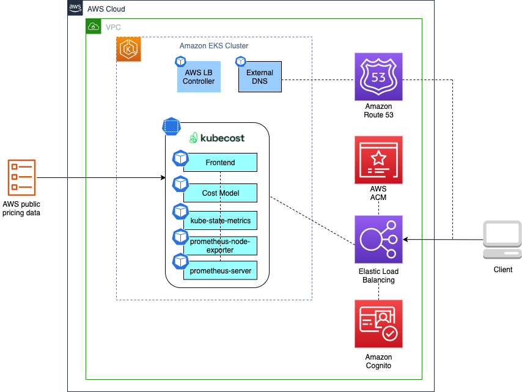

# Secure Ingress using Cognito Pattern

## Objective

Amazon EKS customer with a seamless user registration and authentication experience using Amazon Cognito, Application Load Balancer (ALB) and Amazon Route53. ALB's built-in support for user authentication eliminates the need for writing code to handle routine tasks such as user sign-up, sign-in, and sign-out. In addition to Amazon Cognito, ALB integrates with any OpenID Connect compliant identity provider (IdP) to provide secure authentication and a single sign-on experience across applications. The role of Amazon Certificate Manager (ACM) and Amazon Route53 in this integration is to ensure the security of the user authentication process. ACM provides SSL/TLS certificates that can be used to secure connections to the Application Load Balancer (ALB) and authenticate users. This helps protect sensitive information, such as user credentials, from being intercepted or tampered with during transmission.

Amazon Route53, on the other hand, provides a scalable and highly available Domain Name System (DNS) service. It can be used to route user requests to the correct location and ensure that the authentication process is available and accessible to users at all times. By integrating ACM and Route53 with ALB and Amazon Cognito, the solution ensures that user authentication is secure and reliable.

Kubecost is a cost optimization tool for Kubernetes that helps customers manage and reduce the costs associated with their Kubernetes clusters. It provides real-time cost visibility and analysis, enabling customers to make informed decisions about resource allocation and utilization. With Kubecost, customers can optimize their spending, improve resource efficiency, and increase their cost savings.

The pattern described in this project is based on Kubecost and can be extended for use with similar cost optimization tools or customer applications. The Kubecost dashboard does not have native support for authentication, so an external authentication mechanism is required. This pattern utilizes Amazon Cognito authentication to secure the application's ingress. By implementing this pattern, customers can ensure that their applications are protected and accessible only to authorized users while also benefiting from the cost optimization capabilities of Kubecost. This pattern can be easily adapted and extended to secure ingress for other applications, providing a unified and secure solution for user authentication while optimizing costs.

## Architecture




## Approach

This blueprint will include the following:

* A new Well-Architected VPC with both Public and Private subnets.
* A new Well-Architected EKS cluster in the region and account you specify.
* [EBS CSI Driver Amazon EKS Add-on](https://aws-quickstart.github.io/cdk-eks-blueprints/addons/ebs-csi-driver/) allows Amazon Elastic Kubernetes Service (Amazon EKS) clusters to manage the lifecycle of Amazon EBS volumes for persistent volumes.
* AWS and Kubernetes resources needed to support [AWS Load Balancer Controller](https://docs.aws.amazon.com/eks/latest/userguide/aws-load-balancer-controller.html).
* [Amazon VPC CNI add-on (VpcCni)](https://docs.aws.amazon.com/eks/latest/userguide/managing-vpc-cni.html) into your cluster to support native VPC networking for Amazon EKS.
* [External-DNS](https://github.com/kubernetes-sigs/external-dns) allows integration of exposed Kubernetes services and Ingresses with DNS providers
* [Kubecost](https://kubecost.com/) provides real-time cost visibility and insights by uncovering patterns that create overspending on infrastructure to help teams prioritize where to focus optimization efforts
* [Argo CD](https://aws-quickstart.github.io/cdk-eks-blueprints/addons/argo-cd/) is a declarative, GitOps continuous delivery tool for Kubernetes. The Argo CD add-on provisions Argo CD into an EKS cluster, and bootstraping your workloads from public and private Git repositories.
* Create the necessary Cognito resources like user pool, user pool client, domain etc.., and passed to the Argo CD app of apps pattern from which ingress resources can reference.

## GitOps confguration

For GitOps, the blueprint bootstrap the ArgoCD addon and points to the [EKS Blueprints Workload](https://github.com/aws-samples/eks-blueprints-workloads) sample repository.


## Prerequisites

1. The parent domain must exist.

## Deploying

1. argo-admin-password secret must be defined as plain text (not key/value) in `us-west-2`  region.

```
aws secretsmanager create-secret --name argo-admin-password \
    --description "Admin Password for ArgoCD" \
    --secret-string {"$zRrGdeYOCQJ"}
    --region us-west-2
    --kms-key-id "aws/secretsmanager"
```
2. The actual settings for the hosted zone name and expected subzone name are expected to be specified in the CDK context. Generically it is inside the cdk.context.json file of the current directory or in `~/.cdk.json` in your home directory. 

Example settings: Update the context in `cdk.json` file located in `cdk-eks-blueprints-patterns` directory

```
 
    "context": {
        "parent.hostedzone.name": "mycompany.a2z.com",
        "dev.subzone.name": "dev.mycompany.a2z.com"
      }
```

3. Once all pre-requisites are set you are ready to deploy the pipeline. Run the following command from the root of this repository to deploy the pipeline stack:

```
make build
npx cdk deploy secure-ingress-blueprint
```


## Cluster Access

Once the deploy completes, you will see output in your terminal window similar to the following:

```
Outputs:
secure-ingress-blueprint.secureingressblueprintClusterNameD6A1BE5C = secure-ingress-blueprint
secure-ingress-blueprint.secureingressblueprintConfigCommandD0275968 =  aws eks update-kubeconfig —name secure-ingress-blueprint —region us-west-2 —role-arn arn:aws:iam::<ACCOUNT ID>:role/secure-ingress-blueprint-secureingressblueprintMas-7JD5S67SG7M0
secure-ingress-blueprint.secureingressblueprintGetTokenCommand21BE2184 =  aws eks get-token —cluster-name secure-ingress-blueprint —region us-west-2 —role-arn arn:aws:iam::<ACCOUNT ID>:role/secure-ingress-blueprint-secureingressblueprintMas-7JD5S67SG7M0
```
```
Stack ARN:
arn:aws:cloudformation:us-west-2:<ACCOUNT ID>:stack/secure-ingress-blueprint/64017120-91ce-11ed-93b2-0a67951f5d5d
```


To update your Kubernetes config for your new cluster, copy and run the secure-ingress-blueprint.secureingressblueprintConfigCommandD0275968 command (the second command) in your terminal.

```
aws eks update-kubeconfig —name secure-ingress-blueprint —region us-west-2 —role-arn arn:aws:iam::<ACCOUNT ID>:role/secure-ingress-blueprint-secureingressblueprintMas-7JD5S67SG7M0
```

Validate that you now have kubectl access to your cluster via the following:

```
kubectl get all -n kubecost
```

You should see output that lists all namespaces in your cluster.


## Test authentication

Point your browser to the URL of the Kubecost app in your cluster. You can get the URL from the cdk.json file using the below command.

```
awk -F':' '/dev.subzone.name/ {print $2}' cdk.json | tr -d '",' | xargs echo
```

Your browser will be redirected to a sign-in page. This page is provided by Amazon Cognito hosted UI.

Since this is your first time accessing the application, sign up as a new user. The data you input here will be saved in the Amazon Cognito user pool you created earlier in the post. 


Select “Sign up” and use your email address and create a password


Use the verification code received in your email and confirm the account. Once you sign in, ALB will send you to the Kubecost app’s UI:


Select the “AWS Cluster #1” to view the cost overview, savings and efficiency details.


