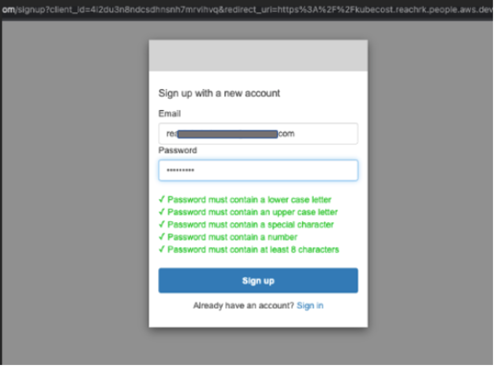

# Secure Ingress using Cognito Pattern

## Objective

Amazon EKS customers that use Application Load Balancer (ALB) can use Amazon Cognito to handle user registration and authentication without writing code to handle routine tasks such as user sign-up, sign-in, sign-out, and so on. This is because Application Load Balancer has built-in support for user authentication. In addition to Amazon Cognito, ALB natively integrates with any OpenID Connect protocol compliant identity provider (IdP), providing secure authentication and a single sign-on experience across your applications.

In this pattern, we will be demonstrating the process to setup Kubecost on Amazon EKS and authentication users to Kubecost on Amazon EKS using CDK EKS Blueprints patterns.  The Kubecost dashboard does not provide native support for authentication. It requires an external authentication mechanism. This pattern will help customers secure their application's ingress using Amazon Cognito authentication. 

## Approach

This blueprint will include the following:

* A new Well-Architected VPC with both Public and Private subnets.
* A new Well-Architected EKS cluster in the region and account you specify.
* [Metrics Server](https://github.com/kubernetes-sigs/metrics-server) into your cluster to support metrics collection.
* AWS and Kubernetes resources needed to support [Cluster Autoscaler](https://docs.aws.amazon.com/eks/latest/userguide/cluster-autoscaler.html).
* [EBS CSI Driver Amazon EKS Add-on](https://aws-quickstart.github.io/cdk-eks-blueprints/addons/ebs-csi-driver/) allows Amazon Elastic Kubernetes Service (Amazon EKS) clusters to manage the lifecycle of Amazon EBS volumes for persistent volumes.
* AWS and Kubernetes resources needed to support [AWS Load Balancer Controller](https://docs.aws.amazon.com/eks/latest/userguide/aws-load-balancer-controller.html).
* [Amazon VPC CNI add-on (VpcCni)](https://docs.aws.amazon.com/eks/latest/userguide/managing-vpc-cni.html) into your cluster to support native VPC networking for Amazon EKS.
* [External-DNS](https://github.com/kubernetes-sigs/external-dns) allows integration of exposed Kubernetes services and Ingresses with DNS providers
* [Kubecost](https://kubecost.com/) provides real-time cost visibility and insights by uncovering patterns that create overspending on infrastructure to help teams prioritize where to focus optimization efforts
* [Argo CD](https://aws-quickstart.github.io/cdk-eks-blueprints/addons/argo-cd/) is a declarative, GitOps continuous delivery tool for Kubernetes. The Argo CD add-on provisions Argo CD into an EKS cluster, and bootstraping your workloads from public and private Git repositories.
* Create the necessary Cognito resources like user pool, user pool client, domain etc.., and passed to the Argo CD app of apps pattern from which ingress resources can reference.

## GitOps confguration

For GitOps, the blueprint bootstrap the ArgoCD addon and points to the [EKS Blueprints Workload](https://github.com/aws-samples/eks-blueprints-workloads) sample repository.


## Prerequisites
1. `argo-admin-password` secret must be defined as plain text (not key/value) in `us-west-2`  region.
2. The parent domain must exist.
3. The actual settings for the parent domain, hosted zone name and expected subzone name are expected to be specified in the CDK context. Generically it is inside the cdk.context.json file of the current directory or in `~/.cdk.json` in your home directory. Example settings:
```
{
  "context": {
    "parent.hostedzone.name": "mycompany.a2z.com",
    "dev.subzone.name": "dev.mycompany.a2z.com",
  }
}
```


## Deploying

1. Refer the setup section in README file of this repository and configure your machine
2. Once all pre-requisites are set you are ready to deploy the pipeline. Run the following command from the root of this repository to deploy the pipeline stack:

```bash
make build
npx cdk deploy secure-ingress-blueprint
```

## Cluster Access

Once the deploy completes, you will see output in your terminal window similar to the following:

```
Outputs:
secure-ingress-blueprint.secureingressblueprintClusterNameD6A1BE5C = secure-ingress-blueprint
secure-ingress-blueprint.secureingressblueprintConfigCommandD0275968 =  aws eks update-kubeconfig —name secure-ingress-blueprint —region us-west-2 —role-arn arn:aws:iam::<ACCOUNT ID>:role/secure-ingress-blueprint-secureingressblueprintMas-7JD5S67SG7M0
secure-ingress-blueprint.secureingressblueprintGetTokenCommand21BE2184 =  aws eks get-token —cluster-name secure-ingress-blueprint —region us-west-2 —role-arn arn:aws:iam::<ACCOUNT ID>:role/secure-ingress-blueprint-secureingressblueprintMas-7JD5S67SG7M0
```
```
Stack ARN:
arn:aws:cloudformation:us-west-2:<ACCOUNT ID>:stack/secure-ingress-blueprint/64017120-91ce-11ed-93b2-0a67951f5d5d
```


To update your Kubernetes config for you new cluster, copy and run the secure-ingress-blueprint.secureingressblueprintConfigCommandD0275968 command (the second command) in your terminal.

```
aws eks update-kubeconfig —name secure-ingress-blueprint —region us-west-2 —role-arn arn:aws:iam::<ACCOUNT ID>:role/secure-ingress-blueprint-secureingressblueprintMas-7JD5S67SG7M0
```

Validate that you now have kubectl access to your cluster via the following:

```
kubectl get namespace
```

You should see output that lists all namespaces in your cluster.


## Test authentication

Point your browsers to the URL of the Kubecost app in your cluster. Your browser will be redirected to a sign-in page. This page is provided by Amazon Cognito hosted UI.

Since this is your first time accessing the application, sign up as a new user. The data you input here will be saved in the Amazon Cognito user pool you created earlier in the post. 


Select “Sign up” and use your email address and create a password




Use the verification code received in your email and confirm the account. Once you sign in, ALB will send you to the Kubecost app’s UI:


Select the “AWS Cluster #1” to view the cost overview, savings and efficiency details.


