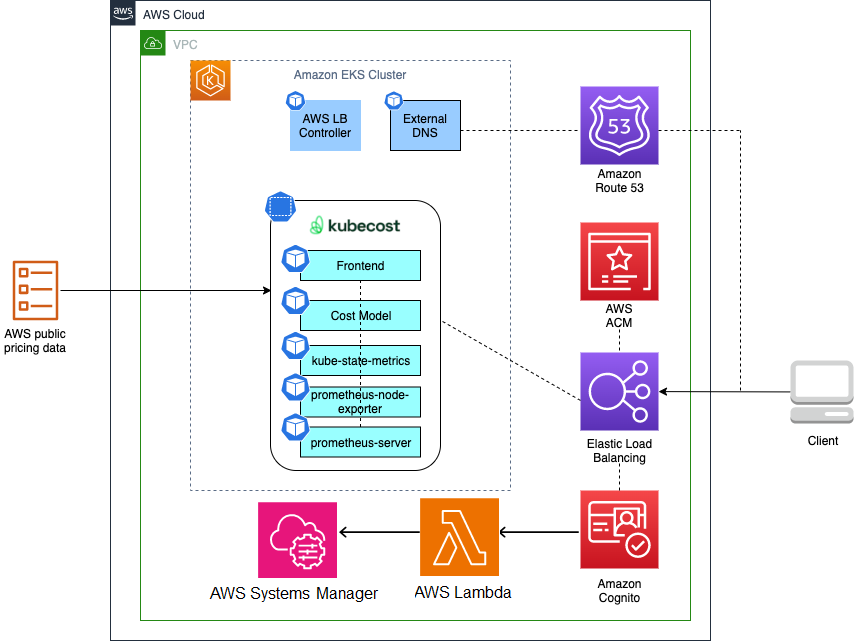
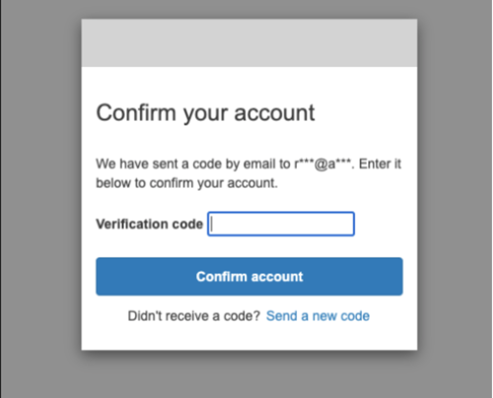

# Secure Ingress using Cognito Pattern

## Objective

The objective of this pattern is to provide a secure authentication mechanism for customer applications using Amazon Cognito, ALB, and Route53, ensuring that only authorized users can access the application. The Kubecost tool is used as a reference or sample implementation to demonstrate the pattern's capabilities.

To achieve this objective, the pattern utilizes Amazon Cognito to provide user authentication for the application's ingress, with ALB's built-in support for user authentication handling routine tasks such as user sign-up, sign-in, and sign-out. In addition to Amazon Cognito, ALB integrates with any OpenID Connect compliant identity provider (IdP) for a single sign-on experience across applications. ACM and Route53 provide SSL/TLS certificates to secure connections to ALB and authenticate users, preventing sensitive information from being intercepted or tampered with during transmission.

The pattern also leverages Kubecost to provide real-time cost visibility and analysis for Kubernetes clusters, enabling customers to make informed decisions about resource allocation and utilization. This pattern can be easily adapted and extended to secure ingress for any application, providing a unified and secure solution for user authentication while optimizing costs. By implementing this solution, Amazon EKS customers can have a reliable, scalable, and secure authentication mechanism for their applications, with a cost optimization tool to manage and reduce the costs associated with their Kubernetes clusters.


## Architecture




## Approach

This blueprint will include the following:

* A new Well-Architected VPC with both Public and Private subnets.
* A new Well-Architected EKS cluster in the region and account you specify.
* [EBS CSI Driver Amazon EKS Add-on](https://aws-quickstart.github.io/cdk-eks-blueprints/addons/ebs-csi-driver/) allows Amazon Elastic Kubernetes Service (Amazon EKS) clusters to manage the lifecycle of Amazon EBS volumes for persistent volumes.
* AWS and Kubernetes resources needed to support [AWS Load Balancer Controller](https://docs.aws.amazon.com/eks/latest/userguide/aws-load-balancer-controller.html).
* [Amazon VPC CNI add-on (VpcCni)](https://docs.aws.amazon.com/eks/latest/userguide/managing-vpc-cni.html) into your cluster to support native VPC networking for Amazon EKS.
* [External-DNS](https://github.com/kubernetes-sigs/external-dns) allows integration of exposed Kubernetes services and Ingresses with DNS providers
* [Kubecost](https://kubecost.com/) provides real-time cost visibility and insights by uncovering patterns that create overspending on infrastructure to help teams prioritize where to focus optimization efforts
* [Argo CD](https://aws-quickstart.github.io/cdk-eks-blueprints/addons/argo-cd/) is a declarative, GitOps continuous delivery tool for Kubernetes. The Argo CD add-on provisions Argo CD into an EKS cluster, and bootstraping your workloads from public and private Git repositories.
* Create the necessary Cognito resources like user pool, user pool client, domain, [Pre sign-up Lambda trigger and Pre authentication Lambda triggers](https://docs.aws.amazon.com/cognito/latest/developerguide/cognito-user-identity-pools-working-with-aws-lambda-triggers.html)  etc.., and passed to the Argo CD app of apps pattern from which ingress resources can reference.

## GitOps confguration

For GitOps, the blueprint bootstrap the ArgoCD addon and points to the [EKS Blueprints Workload](https://github.com/aws-samples/eks-blueprints-workloads) sample repository.


## Prerequisites

1. Follow the usage [instructions](../../../README.md#usage) to install the dependencies

## Deploy

1. Let’s start by setting a few environment variables. Change the Region as needed.

```
ACCOUNT_ID=$(aws sts get-caller-identity --query 'Account' --output text)
AWS_REGION=us-west-2
```

2. Clone the repository and install dependency packages. This repository contains CDK v2 code written in TypeScript.

```
git clone https://github.com/aws-samples/cdk-eks-blueprints-patterns.git
cd cdk-eks-blueprints-patterns
npm i
```

3. argo-admin-password secret must be defined as plain text (not key/value) in `us-west-2`  region.

```
aws secretsmanager create-secret --name argo-admin-secret \
    --description "Admin Password for ArgoCD" \
    --secret-string "password123$" \
    --region "us-west-2"
```
4. The actual settings for the hosted zone name and expected subzone name are expected to be specified in the CDK context. Generically it is inside the cdk.context.json file of the current directory or in `~/.cdk.json` in your home directory. 

Example settings: Update the context in `cdk.json` file located in `cdk-eks-blueprints-patterns` directory

```
    "context": {
        "parent.hostedzone.name": "mycompany.a2z.com",
        "dev.subzone.name": "dev.mycompany.a2z.com"
      }
```

5. Create below Parameters with correct Email Ids and Email Domains in the AWS System Manager Parameter Store. The sample custom logic implemented (for demo purpose here) in `Pre sign-up Lambda trigger`
   function does two things. First, it allows new User sign-up only if their Email domain matches with any of the Email Domains configured with `/secure-ingress-auth-cognito/ALLOWED_DOMAINS` Parameter. 
   Second, it auto approves the new User sign-up without needing to verify Email Verification code, if their Email domain matches with any of the Email Domains configured with `/secure-ingress-auth-cognito/AUTO_APPROVED_DOMAINS` Parameter. 
   The custom logic implemented in `Pre authentication Lambda trigger` function allows logins for only Whitelisted Email Ids configured with with `/secure-ingress-auth-cognito/EMAIL_WHITE_LIST` Parameter. 

```        
    export SSM_PARAMETER_KEY="/secure-ingress-auth-cognito/ALLOWED_DOMAINS"
    export SSM_PARAMETER_VALUE="emaildomain1.com,emaildomain2.com"
    
    aws ssm put-parameter \
      --name "$SSM_PARAMETER_KEY" \
      --value "$SSM_PARAMETER_VALUE" \
      --type "String" \
      --region $AWS_REGION
    
    export SSM_PARAMETER_KEY="/secure-ingress-auth-cognito/AUTO_APPROVED_DOMAINS"
    export SSM_PARAMETER_VALUE="emaildomain1.com"
    
    aws ssm put-parameter \
      --name "$SSM_PARAMETER_KEY" \
      --value "$SSM_PARAMETER_VALUE" \
      --type "String" \
      --region $AWS_REGION
      
    export SSM_PARAMETER_KEY="/secure-ingress-auth-cognito/EMAIL_WHITE_LIST"
    export SSM_PARAMETER_VALUE="my-email-1@emaildomain1.com,my-email-2@emaildomain2.com"
    
    aws ssm put-parameter \
      --name "$SSM_PARAMETER_KEY" \
      --value "$SSM_PARAMETER_VALUE" \
      --type "String" \
      --region $AWS_REGION  
  
```

6. Execute the commands below to bootstrap the AWS environment in `us-west-2`

```
cdk bootstrap aws://$ACCOUNT_ID/$AWS_REGION
```

7. Run the following command from the root of this repository to deploy the pipeline stack:

```
make build
make pattern secure-ingress-cognito deploy secure-ingress-blueprint
```

## Cluster Access

Once the deploy completes, you will see output in your terminal window similar to the following:

```
Outputs:
secure-ingress-blueprint.secureingressblueprintClusterNameD6A1BE5C = secure-ingress-blueprint
secure-ingress-blueprint.secureingressblueprintConfigCommandD0275968 =  aws eks update-kubeconfig —name secure-ingress-blueprint —region us-west-2 —role-arn arn:aws:iam::<ACCOUNT ID>:role/secure-ingress-blueprint-secureingressblueprintMas-7JD5S67SG7M0
secure-ingress-blueprint.secureingressblueprintGetTokenCommand21BE2184 =  aws eks get-token —cluster-name secure-ingress-blueprint —region us-west-2 —role-arn arn:aws:iam::<ACCOUNT ID>:role/secure-ingress-blueprint-secureingressblueprintMas-7JD5S67SG7M0
```
```
Stack ARN:
arn:aws:cloudformation:us-west-2:<ACCOUNT ID>:stack/secure-ingress-blueprint/64017120-91ce-11ed-93b2-0a67951f5d5d
```


To update your Kubernetes config for your new cluster, copy and run the secure-ingress-blueprint.secureingressblueprintConfigCommandD0275968 command (the second command) in your terminal.

```
aws eks update-kubeconfig —name secure-ingress-blueprint —region us-west-2 —role-arn arn:aws:iam::<ACCOUNT ID>:role/secure-ingress-blueprint-secureingressblueprintMas-7JD5S67SG7M0
```

Validate that you now have kubectl access to your cluster via the following:

```
kubectl get all -n kubecost
```

You should see output that lists all namespaces in your cluster.


## Test authentication

Point your browser to the URL of the Kubecost app in your cluster. You can get the URL from the cdk.json file using the below command.

```
awk -F':' '/dev.subzone.name/ {print $2}' cdk.json | tr -d '",' | xargs echo
```

Your browser will be redirected to a sign-in page. This page is provided by Amazon Cognito hosted UI.

Since this is your first time accessing the application, sign up as a new user. The data you input here will be saved in the Amazon Cognito user pool you created earlier in the post. 


Select “Sign up” and use your email address and create a password




Use the verification code received in your email and confirm the account. Once you sign in, ALB will send you to the Kubecost app’s UI:


Select the “AWS Cluster #1” to view the cost overview, savings and efficiency details.


