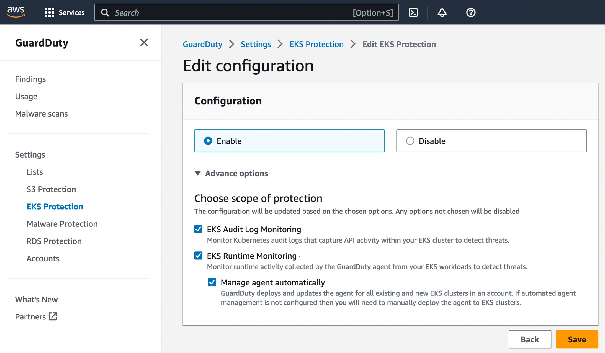

# Amazon GuardDuty Protection

## Objective

The objective of this pattern is to demonstrate how to enable Amazon GuardDuty Detector across your AWS accounts, use GuardDuty optional features, and how to automate notifications via Amazon SNS based on security vulnerabilities triggered by Amazon GuardDuty.

Supported features:

- [Foundational data sources](https://docs.aws.amazon.com/guardduty/latest/ug/guardduty_data-sources.html) - these data sources are enabled by default, no need to mention them in the pattern input
- [EKS Audit Log Monitoring](https://docs.aws.amazon.com/guardduty/latest/ug/guardduty-eks-audit-log-monitoring.html)
- [EKS Runtime Monitoring](https://docs.aws.amazon.com/guardduty/latest/ug/guardduty-eks-runtime-monitoring.html)
- [Malware Protection in Amazon GuardDuty](https://docs.aws.amazon.com/guardduty/latest/ug/malware-protection.html)
- [GuardDuty RDS Protection](https://docs.aws.amazon.com/guardduty/latest/ug/rds-protection.html)
- [Amazon S3 Protection in Amazon GuardDuty](https://docs.aws.amazon.com/guardduty/latest/ug/s3-protection.html)

The pattern consists of two components:

- `GuardDutySetupStack` - enables GuardDuty Detector for the account. The stack also creates an SNS topic, SNS Subscription, and Amazon EventBridge Rule.
- A blueprint that deploys a sample GitOps workload that triggers a GuardDuty finding.

The list of optional features is adjustable via the `features` parameter in the [GuardDutySetupStack](../../../lib/security/guardduty-construct/guardduty-setup.ts) stack.

## GitOps configuration

For GitOps, the blueprint bootstraps the ArgoCD addon and points to the [EKS Blueprints Workload](https://github.com/aws-samples/eks-blueprints-workloads) sample repository.

The sample repository contains the following workloads:

- `team-danger` runs a pod in a privileged mode which is a [security anti-pattern](https://docs.aws.amazon.com/guardduty/latest/ug/guardduty_finding-types-kubernetes.html#privilegeescalation-kubernetes-privilegedcontainer)
- `team-danger` runs a pod with a [malicious file](https://docs.aws.amazon.com/guardduty/latest/ug/findings-malware-protection.html#execution-malware-kubernetes-maliciousfile)

## Prerequisites

1. Clone the repository
2. Follow the usage [instructions](../../../README.md#usage) to install the dependencies
3. `argo-admin-password` secret must be defined in Secrets Manager in the same region as the EKS cluster.

## Deploy

To update npm, run the following command:

```bash
npm install -g npm@latest
```

To bootstrap the CDK toolkit and list all stacks in the app, run the following commands:

```bash
cdk bootstrap
make list
```

### Deploying the `GuardDutySetupStack` stack

The `GuardDutySetupStack` stack enables GuardDuty Detector for the account with all the features of your choice enabled. For the purposes of the Security seciton of this workshop only the GuardDuty EKS Protection features are required.



**Note:** You can only deploy this stack if you have not already enabled GuardDuty in the target account and region. If GuardDuty has been enabled already, do not attempt to deploy the stack as GuardDuty can only be enabled once per account and region. Instead, check that the [EKS Protection](https://docs.aws.amazon.com/guardduty/latest/ug/kubernetes-protection.html) features have been enabled either in the AWS GuardDuty console as shown in the image above, or using the AWS CLI, then proceed to **Deploying the blueprint workload** step.

To deploy the stack, run the following command:

```bash
make pattern guardduty deploy guardduty-setup
```

### Deploying the blueprint workload

The blueprint deploys a sample GitOps workload that triggers a GuardDuty finding.

To deploy the blueprint, run the following command:

```bash
make pattern guardduty deploy guardduty-blueprint
```

## Verify

Run update-kubeconfig command. You should be able to get the command from CDK output message. More information can be found [here](https://aws-quickstart.github.io/cdk-eks-blueprints/getting-started/#cluster-access). Please replace `<your cluster name>`, `<your region>`, and `<your cluster role arn>` with the values from the CDK output message.

```bash
aws eks update-kubeconfig --name <your cluster name> --region <your region> --role-arn <your cluster role arn>
```

### Verifying that the GuardDuty detector is enabled

Now you can check that the GuardDuty detector is successfully enabled with all the required data sources.

To list all detectors in the region, run the following command:

```bash
aws guardduty list-detectors --region us-east-1
```

The output should look like this:

```json
{
    "DetectorIds": [
        "80c3c03d44819a984b035b000aa9b3da"
    ]
}
```

To check the detector's configuration, run the following command (please replace `<DETECTOR-ID>` with the ID of the detector):

```bash
aws guardduty get-detector --detector-id <DETECTOR-ID> --region us-east-1
```

The output should look like this:

```json
{
    "CreatedAt": "2023-04-14T15:55:27.088Z",
    "FindingPublishingFrequency": "SIX_HOURS",
    "ServiceRole": "arn:aws:iam::123456789012:role/aws-service-role/guardduty.amazonaws.com/AWSServiceRoleForAmazonGuardDuty",
    "Status": "ENABLED",
    "UpdatedAt": "2023-04-14T15:55:27.088Z",
    "DataSources": {
        "CloudTrail": {
            "Status": "ENABLED"
        },
        "DNSLogs": {
            "Status": "ENABLED"
        },
        "FlowLogs": {
            "Status": "ENABLED"
        },
        "S3Logs": {
            "Status": "ENABLED"
        },
        "Kubernetes": {
            "AuditLogs": {
                "Status": "ENABLED"
            }
        },
        "MalwareProtection": {
            "ScanEc2InstanceWithFindings": {
                "EbsVolumes": {
                    "Status": "ENABLED"
                }
            },
            "ServiceRole": "arn:aws:iam::123456789012:role/aws-service-role/malware-protection.guardduty.amazonaws.com/AWSServiceRoleForAmazonGuardDutyMalwareProtection"
        }
    },
    "Tags": {},
    "Features": [
        {
            "Name": "CLOUD_TRAIL",
            "Status": "ENABLED",
            "UpdatedAt": "2023-04-14T11:08:44-05:00"
        },
        {
            "Name": "DNS_LOGS",
            "Status": "ENABLED",
            "UpdatedAt": "2023-04-14T11:08:44-05:00"
        },
        {
            "Name": "FLOW_LOGS",
            "Status": "ENABLED",
            "UpdatedAt": "2023-04-14T11:08:44-05:00"
        },
        {
            "Name": "S3_DATA_EVENTS",
            "Status": "ENABLED",
            "UpdatedAt": "2023-04-14T10:55:27-05:00"
        },
        {
            "Name": "EKS_AUDIT_LOGS",
            "Status": "ENABLED",
            "UpdatedAt": "2023-04-14T10:55:27-05:00"
        },
        {
            "Name": "EBS_MALWARE_PROTECTION",
            "Status": "ENABLED",
            "UpdatedAt": "2023-04-14T10:55:27-05:00"
        },
        {
            "Name": "RDS_LOGIN_EVENTS",
            "Status": "ENABLED",
            "UpdatedAt": "2023-04-14T10:55:27-05:00"
        },
        {
            "Name": "EKS_RUNTIME_MONITORING",
            "Status": "ENABLED",
            "UpdatedAt": "2023-04-14T10:55:27-05:00",
            "AdditionalConfiguration": [
                {
                    "Name": "EKS_ADDON_MANAGEMENT",
                    "Status": "ENABLED",
                    "UpdatedAt": "2023-04-14T10:55:27-05:00"
                }
            ]
        }
    ]
}
 ```

### Verifying that the GuardDuty findings are generated

To list all findings in the region, run the following command (please replace `<DETECTOR-ID>` with the ID of the detector):

```bash
aws guardduty list-findings --detector-id <DETECTOR-ID> --region us-east-1
```

The output should look like this:

```json
{
    "FindingIds": [
        "f2c3859c6ca25b3057d13470a992bbd7"
    ]
}
```

To check the finding's details, run the following command (please replace `<DETECTOR-ID>` and `<FINDING-ID>` with the ID of the detector and the ID of the finding):

```bash
aws guardduty get-findings --detector-id <DETECTOR-ID> --finding-ids <FINDING-ID> --region us-east-1
```

The list of findings contains `PrivilegeEscalation:Kubernetes/PrivilegedContainer` as expected:

```json
{
    "Findings": [
        {
            "AccountId": "123456789012",
            "Arn": "arn:aws:guardduty:us-east-1:123456789012:detector/94c3858788bc1444ceedab472bab5d7e/finding/f2c3859c6ca25b3057d13470a992bbd7",
            "CreatedAt": "2023-03-22T21:28:07.748Z",
            "Description": "A privileged container with root level access was launched on EKS Cluster guardduty-blueprint. If this behavior is not expected, it may indicate that your credentials are compromised.",
            "Id": "f2c3859c6ca25b3057d13470a992bbd7",
            "Partition": "aws",
            "Region": "us-east-1",
            "Resource": {
                "EksClusterDetails": {
                    "Name": "guardduty-blueprint",
                    "Arn": "arn:aws:eks:us-east-1:123456789012:cluster/guardduty-blueprint",
                    "VpcId": "vpc-02b68c9ddc1d403ab",
                    "Status": "ACTIVE",
                    "Tags": [],
                    "CreatedAt": "2023-03-22T15:48:25.752000-05:00"
                },
                "KubernetesDetails": {
                    "KubernetesUserDetails": {
                        "Username": "system:serviceaccount:argocd:argocd-application-controller",
                        "Uid": "1871d525-442e-487f-ae60-81336d1ff0cf",
                        "Groups": [
                            "system:serviceaccounts",
                            "system:serviceaccounts:argocd",
                            "system:authenticated"
                        ]
                    },
                    "KubernetesWorkloadDetails": {
                        "Name": "privileged-pod",
                        "Type": "pods",
                        "Uid": "33a3c89e-3280-474d-b8cb-fdf03394fc15",
                        "Namespace": "argocd",
                        "HostNetwork": false,
                        "Containers": [
                            {
                                "Name": "app",
                                "Image": "centos",
                                "ImagePrefix": "",
                                "SecurityContext": {
                                    "Privileged": true
                                }
                            }
                        ]
                    }
                },
                "ResourceType": "EKSCluster"
            },
            "SchemaVersion": "2.0",
            "Service": {
                "Action": {
                    "ActionType": "KUBERNETES_API_CALL",
                    "KubernetesApiCallAction": {
                        "RequestUri": "/api/v1/namespaces/argocd/pods",
                        "Verb": "create",
                        "UserAgent": "argocd-application-controller/v0.0.0 (linux/amd64) kubernetes/$Format",
                        "RemoteIpDetails": {
                            "City": {
                                "CityName": "UNKNOWN"
                            },
                            "Country": {},
                            "GeoLocation": {
                                "Lat": 0.0,
                                "Lon": 0.0
                            },
                            "IpAddressV4": "10.0.205.129",
                            "Organization": {
                                "Asn": "0",
                                "AsnOrg": "UNKNOWN",
                                "Isp": "UNKNOWN",
                                "Org": "UNKNOWN"
                            }
                        },
                        "StatusCode": 201
                    }
                },
                "Archived": false,
                "Count": 1,
                "DetectorId": "94c3858788bc1444ceedab472bab5d7e",
                "EventFirstSeen": "2023-03-22T21:27:18.186Z",
                "EventLastSeen": "2023-03-22T21:27:18.630Z",
                "ResourceRole": "TARGET",
                "ServiceName": "guardduty",
                "AdditionalInfo": {
                    "Value": "{}",
                    "Type": "default"
                }
            },
            "Severity": 5,
            "Title": "Privileged container with root level access launched on the EKS Cluster.",
            "Type": "PrivilegeEscalation:Kubernetes/PrivilegedContainer",
            "UpdatedAt": "2023-03-22T21:28:07.748Z"
        }
    ]
}
```

### Verifying that the GuardDuty Runtime Monitoring agents are automatically deployed

To verify that the GuardDuty Runtime Monitoring agents are automatically deployed, run the following command:

```bash
kubectl get pods -A
```

The output should look like this:

```bash
NAMESPACE          NAME                                                              READY   STATUS    RESTARTS        AGE
amazon-guardduty   aws-guardduty-agent-qrm22                                         1/1     Running   0               25m
argocd             blueprints-addon-argocd-application-controller-0                  1/1     Running   0               3m25s
argocd             blueprints-addon-argocd-applicationset-controller-7c4c75877579s   1/1     Running   0               3m25s
argocd             blueprints-addon-argocd-dex-server-c6687d84f-q4697                1/1     Running   1 (3m21s ago)   3m25s
argocd             blueprints-addon-argocd-notifications-controller-7c74f76c5wh4nb   1/1     Running   0               3m25s
argocd             blueprints-addon-argocd-redis-595cc69fff-9985j                    1/1     Running   0               3m25s
argocd             blueprints-addon-argocd-repo-server-7f75c7796c-229c4              1/1     Running   0               3m25s
argocd             blueprints-addon-argocd-server-86867c9dd8-p6qk7                   1/1     Running   0               3m25s
argocd             privileged-pod                                                    1/1     Running   0               115s
kube-system        aws-node-4lhp7                                                    1/1     Running   0               26m
kube-system        coredns-79989457d9-jncrb                                          1/1     Running   0               32m
kube-system        coredns-79989457d9-l5jcg                                          1/1     Running   0               32m
kube-system        kube-proxy-hwkwm                                                  1/1     Running   0               26m
```

As you can see, the GuardDuty Runtime Monitoring agent is deployed in the `amazon-guardduty` namespace.
